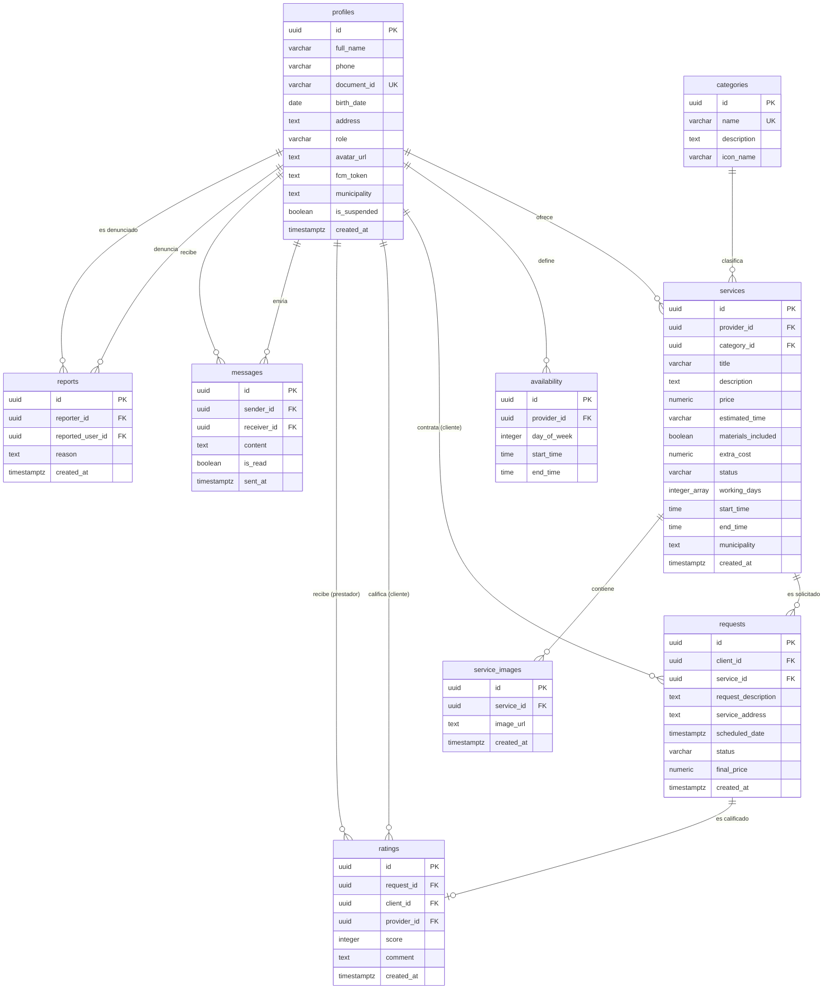

# Diagrama de Entidad-Relación (ERD) - YÁYA

Este diagrama representa la estructura lógica, los atributos y las relaciones de cardinalidad de la base de datos de YÁYA en Supabase PostgreSQL.

---

## 📊 Diagrama Dinámico (Mermaid)

## Previsualizacion del diagrama ER

---

## 🔗 Referencia Cruzada
*   **Esquema SQL Maestro:** [DATABASE_SCHEMA.md](./DATABASE_SCHEMA.md)
*   **Diccionario de Datos:** [DATA_DICTIONARY.md](./DATA_DICTIONARY.md)

---
*Diseño Arquitectónico por BH++ Team - v1.2.0*
