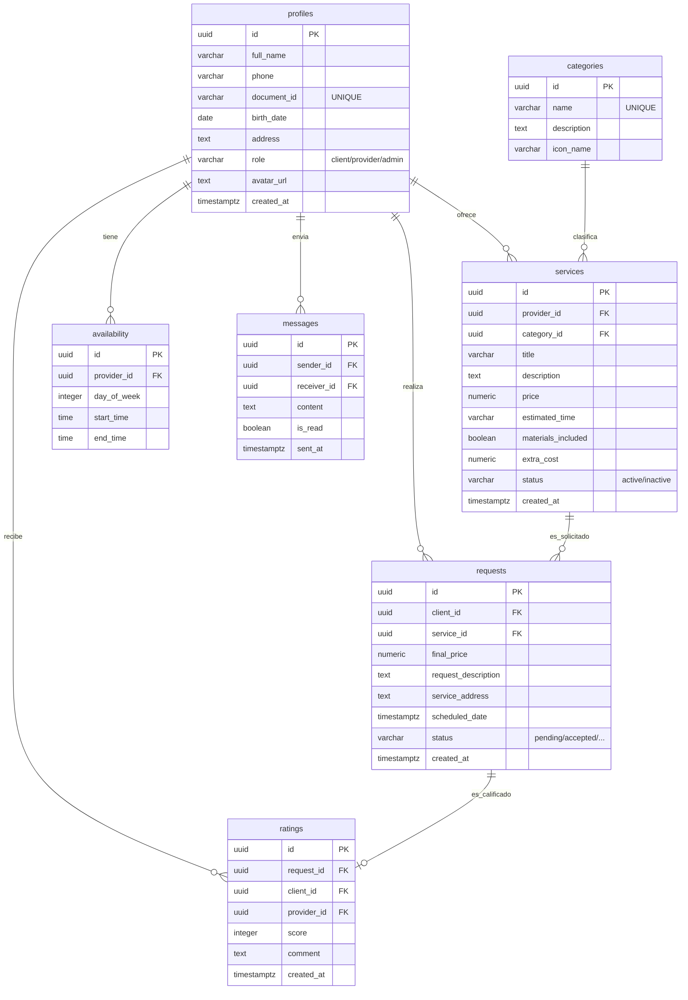

# Diagrama de Entidad-Relación (ERD) - YÁYA

Este diagrama representa la estructura lógica y las relaciones entre las entidades del sistema YÁYA.

```mermaid
erDiagram
    profiles ||--o{ services : "ofrece"
    profiles ||--o{ availability : "tiene"
    profiles ||--o{ requests : "realiza"
    profiles ||--o{ ratings : "recibe"
    profiles ||--o{ messages : "envia"
    categories ||--o{ services : "clasifica"
    services ||--o{ requests : "es_solicitado"
    requests ||--o| ratings : "es_calificado"

    profiles {
        uuid id PK
        varchar full_name
        varchar phone
        varchar document_id "UNIQUE"
        date birth_date
        text address
        varchar role "client/provider/admin"
        text avatar_url
        timestamptz created_at
    }

    categories {
        uuid id PK
        varchar name "UNIQUE"
        text description
        varchar icon_name
    }

    services {
        uuid id PK
        uuid provider_id FK
        uuid category_id FK
        varchar title
        text description
        numeric price
        varchar estimated_time
        boolean materials_included
        numeric extra_cost
        varchar status "active/inactive"
        timestamptz created_at
    }

    availability {
        uuid id PK
        uuid provider_id FK
        integer day_of_week
        time start_time
        time end_time
    }

    requests {
        uuid id PK
        uuid client_id FK
        uuid service_id FK
        numeric final_price
        text request_description
        text service_address
        timestamptz scheduled_date
        varchar status "pending/accepted/..."
        timestamptz created_at
    }

    ratings {
        uuid id PK
        uuid request_id FK
        uuid client_id FK
        uuid provider_id FK
        integer score
        text comment
        timestamptz created_at
    }

    messages {
        uuid id PK
        uuid sender_id FK
        uuid receiver_id FK
        text content
        boolean is_read
        timestamptz sent_at
    }
```

---
*Diseño Arquitectónico por BH++*
