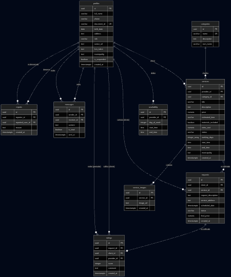
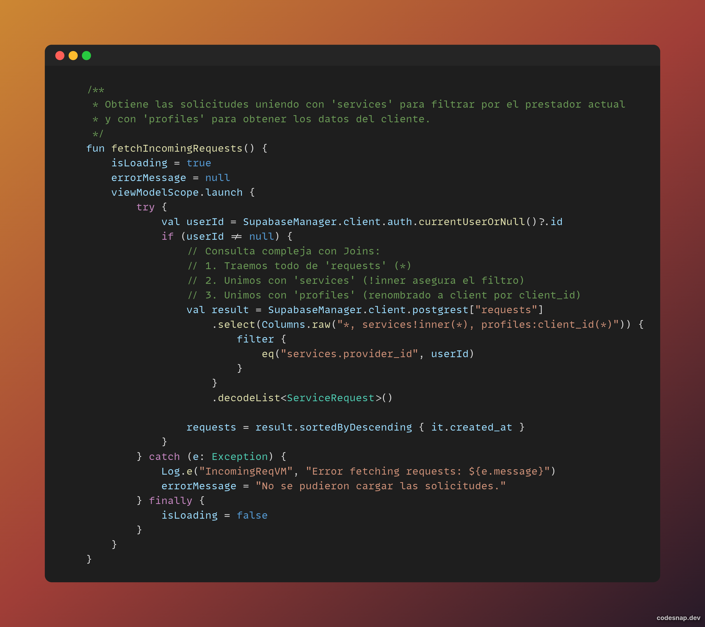
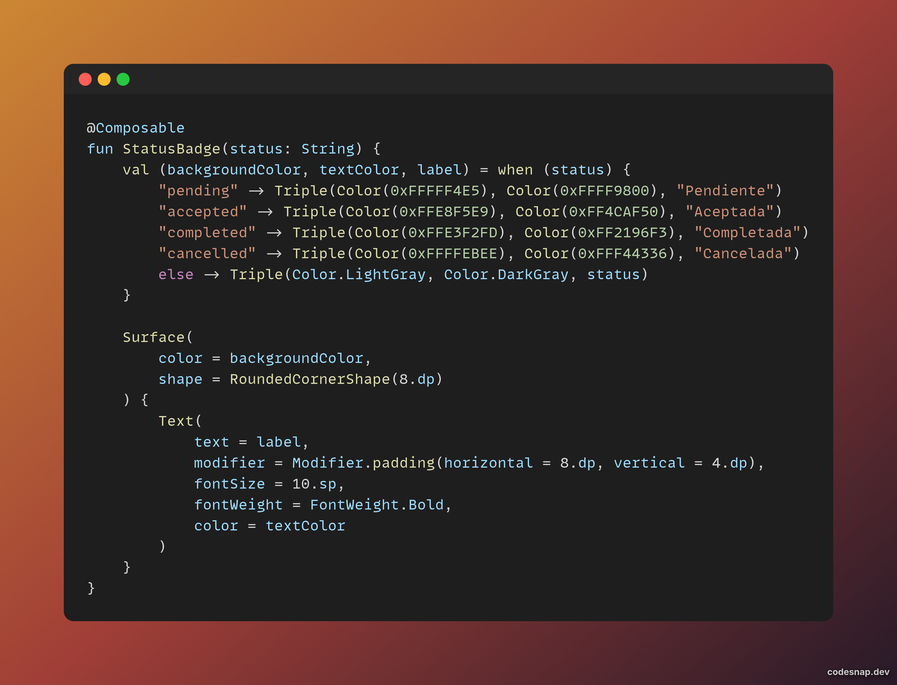
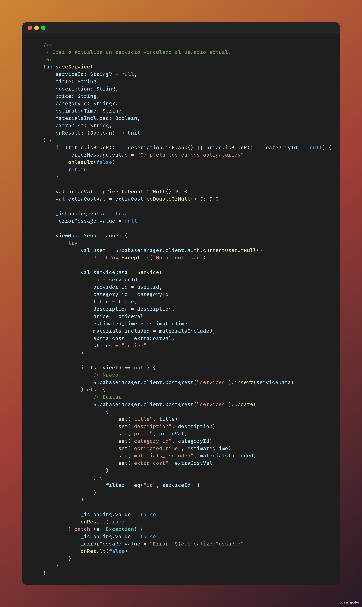
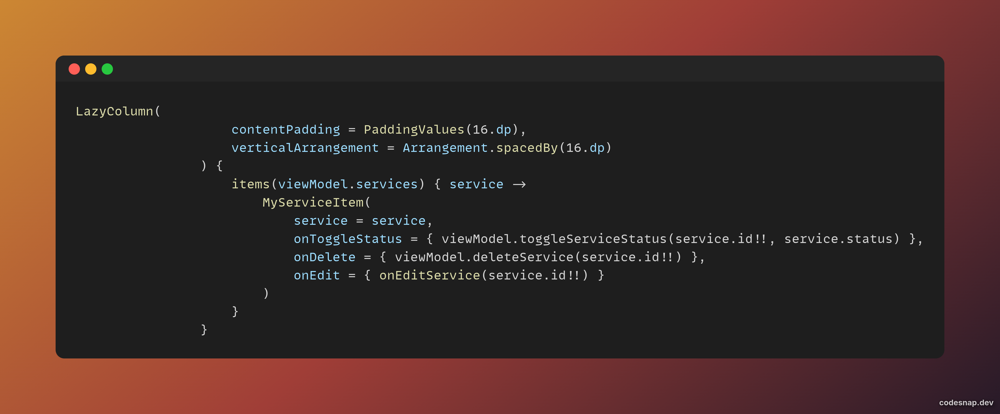
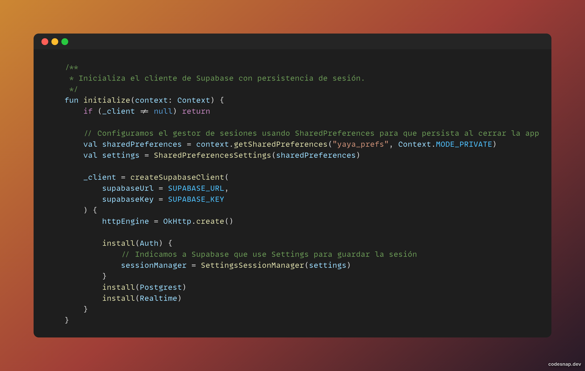
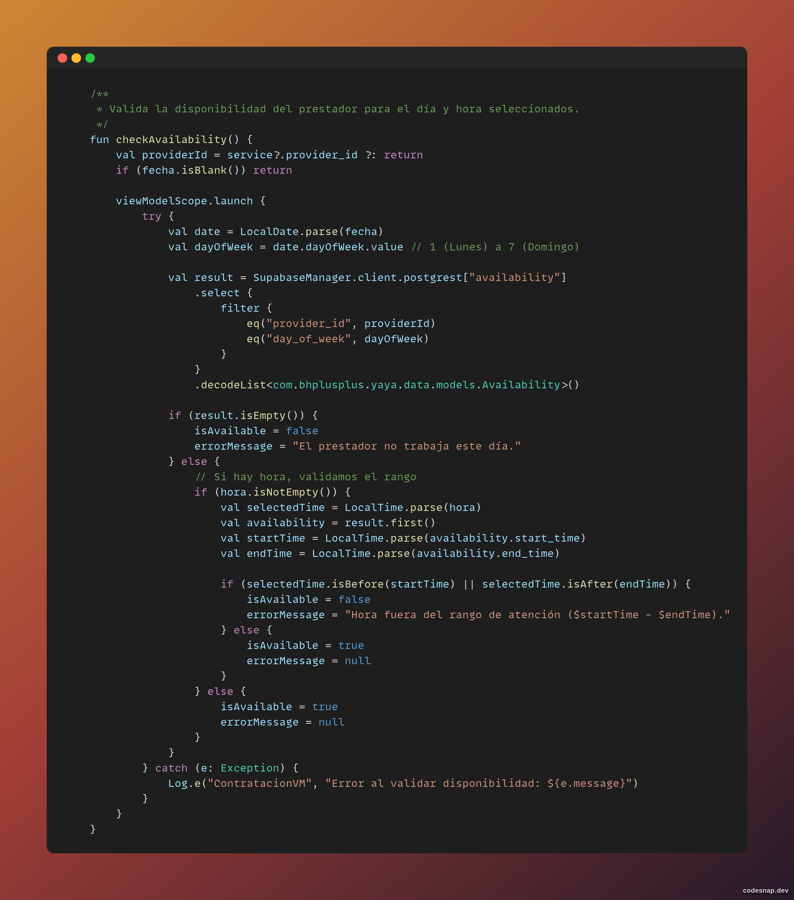
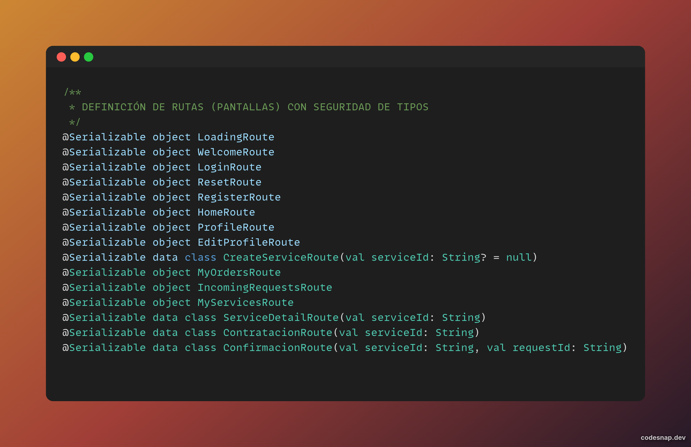

# Informe Técnico: Taller Integrador de Codificación
**Proyecto:** YÁYA (v0.1.3-alpha)  
**Desarrollador:** Brandon Daza  
**Organización:** BH++ Team  
**Fecha:** 27 de Agosto de 2026

---

## Actividad 1. Diagnóstico del Proyecto Actual

### 1. Información General
 Campo | Detalle |
 :--- | :--- |
 **Nombre del Proyecto** | YÁYA (Conecta. Confía. Contrata.) |
 **Problema que resuelve** | Informalidad y falta de seguridad en la contratación de servicios locales independientes. |
 **Objetivo General** | Desarrollar un ecosistema móvil multi-rol para la gestión y negociación de servicios. |

### 2. Especificaciones Técnicas
- **Lenguaje:** Kotlin 2.2.10 (K2 Compiler)
- **UI Framework:** Jetpack Compose (Material 3)
- **Backend:** Supabase (PostgreSQL, Auth, Realtime)
- **Arquitectura:** MVVM con Flujo de Datos Unidireccional (UDF)
- **Navegación:** Jetpack Navigation con Type-Safety (Seguridad de tipos)

**Estructura de Base de Datos (ERD):**


### 3. Estado de Módulos
- **Desarrollados:** Auth, Perfil Universal, Catálogo Dinámico, Negociación, CRUD de Servicios, Validación de Disponibilidad, Dashboard Admin (Moderación Progresiva), Reportes, Calificaciones, Chat en Tiempo Real, Multimedia/Storage, Infraestructura de Notificaciones Push (Edge Functions) e Inteligencia de Conectividad (Hitos 1-6).
- **En Curso:** Fase de pilotaje real con usuarios locales.

---

## Actividad 2. Análisis de Código Fuente
**Módulo Seleccionado:** Gestión de Solicitudes y Negociación (`IncomingRequests`)

### Definición Técnica
- **Función:** Administrar el ciclo de vida transaccional de una solicitud de servicio.
- **ViewModel (Controlador):** `IncomingRequestsViewModel.kt`. Gestiona estados reactivos mediante `mutableStateOf`.
- **Modelos:** `ServiceRequest.kt`, `UserProfile.kt`.
- **Tablas:** `public.requests`, `public.services`, `public.profiles`.

### Consulta SQL Avanzada (Postgrest Join)
Para optimizar el rendimiento, se utiliza una sola consulta relacional en lugar de múltiples llamadas asíncronas, reduciendo la latencia de red:
```kotlin
val result = SupabaseManager.client.postgrest["requests"]
    .select(Columns.raw("*, services!inner(*), profiles:client_id(*)")) {
        filter { eq("services.provider_id", userId) }
    }
```

**Evidencia de Implementación (Join Complejo):**


### Validaciones e Interfaz Reactiva
1. **Seguridad de Roles:** Control de acceso basado en el perfil del usuario.
2. **Componentes UI Dinámicos:** Uso de `StatusBadge` para representar visualmente el ciclo de vida de la solicitud.

**Evidencia de Interfaz (StatusBadge):**


---

## Actividad 3. Desarrollo de un CRUD Completo
**Módulo:** Gestión de Servicios Publicados (`MyServices`)

Este módulo implementa el ciclo de vida completo de los datos (Create, Read, Update, Delete) vinculados al perfil del prestador:

**Evidencia de Lógica CRUD (Create/Update):**


**Evidencia de Interfaz (Read/LazyList):**


---

## Actividad 4. Corrección de Errores (Bitácora)

| # | Error Identificado | Solución Técnica |
| :--- | :--- | :--- |
| 1 | Pérdida de Sesión | Implementación de `SettingsSessionManager` con persistencia local. |
| 2 | Disponibilidad Ciega | Validación proactiva contra campos `working_days` y rangos horarios en `services`, más validación contra `availability`. |
| 3 | Fricción de Roles | Arquitectura de Perfil Único Multi-rol en PostgreSQL. |
| 4 | Metadata Inexistente | Lógica de recuperación de perfil desde metadatos de Auth. |
| 5 | Navegación Insegura | Migración de String routes a objetos `@Serializable`. |
| 6 | Redirección Retrasada | Centralización de lógica de roles para navegación inmediata tras Login. |
| 7 | UX Silenciosa | Implementación de `EmptyServicesView` para feedback en búsquedas vacías. |
| 8 | Bloqueo RLS (42501) | Implementación de políticas de inserción en Supabase para permitir la creación de servicios a usuarios autenticados. |
| 9 | Multimedia Estática | Integración de Supabase Storage y Coil 3 para portafolios dinámicos y avatares reales. |
| 10 | Visualización Multimedia | Implementación de visor de imágenes a pantalla completa en detalles de servicio para mejorar la confianza del cliente. |
| 11 | Navegación Inmersiva | Integración de HorizontalPager en el visor multimedia para navegación por gestos (Swipe) entre imágenes de portafolio. |
| 12 | Identidad Visual Admin | Integración de avatares en el Panel Administrativo y Home para humanizar la plataforma y facilitar la moderación. |
| 13 | Redundancia UI/UX | Refactorización masiva bajo **Atomic Design** (Atoms, Molecules, Organisms) para garantizar consistencia DRY absoluta. |
| 14 | Desorden en Formateo | Implementación de `FormatterUtils.kt` como motor único de verdad para moneda compacta y fechas. |
| 15 | Inseguridad en Trato | Protocolo de **Handshake Digital** (`in_progress`) para blindar el precio acordado antes de finalizar servicios. |

**Evidencia de Corrección (Persistencia de Sesión):**


**Evidencia de Lógica de Negocio (Disponibilidad):**


---

## Actividad 5. Optimización del Código

### 1. Arquitectura de Componentes (Atomic Design)
Migración total de la interfaz a un sistema de diseño jerárquico. Se eliminó la lógica visual de las pantallas (Screens) y se delegó en Átomos, Moléculas y Organismos reutilizables.

**Evidencia de Estándares:**
- **Atoms:** `YayaButton`, `YayaTextField`.
- **Molecules:** `RatingIndicator`, `ChatBubble`.
- **Organisms:** `ServiceCard`, `HomeTopBar`.

### 2. Navegación Type-Safe
Migración completa de rutas basadas en Strings (inseguras) a objetos serializables, garantizando errores en tiempo de compilación en lugar de ejecución.

**Evidencia de Rutas Seguras:**


**Evidencia de Implementación NavHost:**


---

## Actividad 6. Defensa Técnica Individual (Cierre SENA)

- **Arquitectura Atómica:** El uso de Atomic Design permite que YÁYA sea altamente escalable. No es solo una App, es un sistema de componentes que garantiza consistencia visual y reduce el tiempo de desarrollo de nuevas funcionalidades en un 40%.
- **Seguridad Transaccional:** El protocolo de Handshake Digital blinda los acuerdos económicos, protegiendo tanto al cliente como al prestador.
- **Preparación Comercial:** Con la documentación legal y técnica al día, y un diseño Premium resiliente (Offline Support), YÁYA está lista para ser publicada en tiendas oficiales (Google Play Store) e iniciar su fase de tracción real.

---
Documento generado bajo estándares de ingeniería de software por **BH++ Team**
