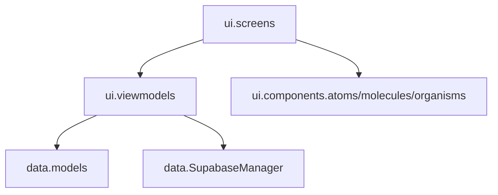
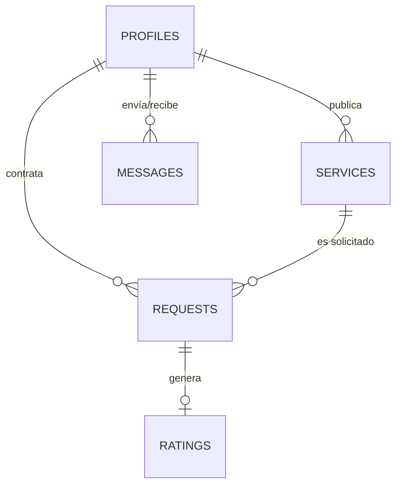

# 📖 Biblia Técnica de Ingeniería y Despliegue - YÁYA

Este documento constituye la fuente de verdad técnica para la plataforma **YÁYA**. Detalla la arquitectura, el modelado de datos, los estándares de codificación y los procedimientos de despliegue para garantizar la escalabilidad y mantenibilidad del sistema por parte de **BH++ Team**.

---

## 1. Arquitectura de Software: Clean MVVM + Atomic Design

YÁYA implementa una arquitectura robusta basada en la separación estricta de responsabilidades, permitiendo que la interfaz sea elástica y la lógica de negocio totalmente independiente.

### 1.1. Capas del Sistema (Package Structure)


*   **UI Layer (Stateless):** Funciones Composable puras que renderizan un `UiState`.
*   **ViewModel Layer:** Controladores de estado que gestionan corrutinas y transforman datos crudos en información lista para la vista (Principio DRY).
*   **Data Layer:** Integración directa con Supabase mediante el cliente global, gestionando Auth, Postgrest y Realtime.

### 1.3. Arquitectura de Clases (MVVM Pattern)
Para cada pantalla, se implementa el siguiente flujo de componentes:

*   **UiState (Data Class):** Inmutable, representa el estado total de la pantalla.
*   **ViewModel (ViewModel):** Única fuente de verdad. Se comunica con el `SupabaseManager` y actualiza el `UiState`.
*   **Screen (Composable):** Recibe el `UiState` y emite eventos de usuario al ViewModel.
*   **Components (Composables):** Átomos y moléculas desacoplados que renderizan partes específicas del `UiState`.

---

## 2. Modelado de Datos y Seguridad (Supabase PostgreSQL)

### 2.1. Diagrama Entidad-Relación (ERD)
YÁYA utiliza un esquema relacional optimizado para la intermediación de servicios:



### 2.2. Seguridad a Nivel de Fila (RLS)
Todas las tablas en Supabase tienen políticas **RLS** activas:
*   **Lectura:** Pública para perfiles y servicios activos.
*   **Escritura:** Restringida al `auth.uid()` del propietario (proteger identidad y finanzas).
*   **Negociación:** Solo el cliente y el prestador vinculados a una `request_id` pueden actualizar su estado.

---

## 3. Stack Tecnológico y Dependencias Clave

*   **Lenguaje:** Kotlin 2.4.10 (K2 Compiler).
*   **Target SDK:** Android API 37.
*   **UI:** Jetpack Compose (Material 3).
*   **Backend:** Supabase (PostgreSQL + Realtime + Storage).
*   **Observabilidad:** Firebase Crashlytics & Analytics (Telemetría de errores y métricas). Se utiliza el wrapper `CrashReporter.kt` para centralizar los reportes.
*   **Notificaciones:** Firebase Cloud Messaging (FCM V1) via Edge Functions.
*   **Multimedia:** Coil 3.1.0 (Async Image Loading).
*   **Reactividad:** Kotlin Flows & Coroutines para flujos asíncronos no bloqueantes.

---

## 4. Guía de Entorno de Desarrollo Local

### 4.1. Configuración del Repositorio
1.  **Clonar:** `git clone https://github.com/Brandon094/Y-YA_Mobile.git`
2.  **Android Studio:** Abrir proyecto con versión Ladybug o superior.
3.  **Variables de Entorno:** Configurar `secrets.properties` en la raíz:
    ```properties
    SUPABASE_URL="https://tu-proyecto.supabase.co"
    SUPABASE_ANON_KEY="tu-anon-key"
    ```

### 4.2. Compilación
*   **Debug:** Ejecutar tarea `app:assembleDebug`.
*   **Release:** Configurar el archivo `.jks` y ejecutar `app:bundleRelease`.

---

## 5. Motor de Notificaciones y Tiempo Real

### 5.1. Observabilidad y Telemetría (Firebase)
YÁYA utiliza un motor dual de captura de errores para garantizar un 99.9% de estabilidad:
1.  **Crashes Fatales:** Capturados automáticamente por la SDK de Firebase Crashlytics.
2.  **Excepciones No Fatales:** Gestionadas por `CrashReporter.kt`. Este componente permite enviar logs personalizados y trazas de error desde bloques `try-catch`, permitiendo depurar fallos en la lógica de Supabase o red sin que la App se cierre para el usuario.

### 5.2. Flujo de Notificación Push (Edge Functions)
YÁYA utiliza lógica Server-Side para automatizar alertas sin saturar el cliente:
1.  Un evento (INSERT/UPDATE) en la DB dispara un **Webhook**.
2.  La Edge Function `notify-yaya-updates` (TypeScript) procesa el evento.
3.  Se identifica al destinatario y se envía la alerta via **FCM API V1**.

### 5.2. Conectividad Resiliente
Implementación de `ConnectivityObserver` basado en Flows que monitorea el hardware de red y notifica mediante el `YayaOfflineBanner` atómico.

---

## 6. Guía de Despliegue (Google Play Store)

1.  **Firmado:** Generar KeyStore oficial encriptado.
2.  **Bundle:** Generar archivo `.aab` (Android App Bundle) optimizado mediante **R8 y minificación de recursos**, lo que reduce drásticamente el peso del binario y protege la propiedad intelectual de BH++.
3.  **Play Console:**
    *   Subir App Bundle a la pista de Pruebas Internas.
    *   Configurar ficha de tienda con los activos de la [Landing Page](../../portal_web/index.html).
    *   Declarar políticas de privacidad vinculadas a `docs/04-legal/PRIVACY_POLICY.md`.

---
*Documento certificado por la Dirección Técnica de BH++ Team - 2026*
