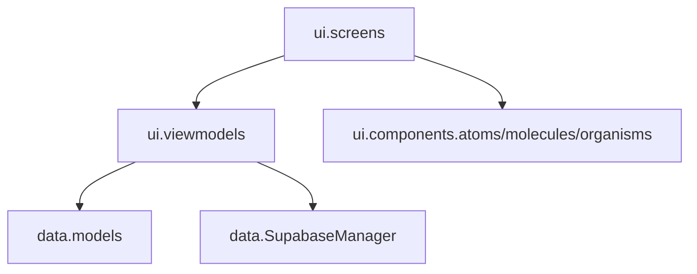
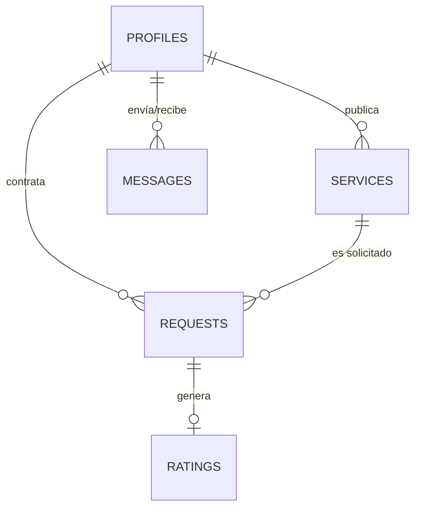

# Biblia Técnica de Ingeniería y Despliegue - YÁYA (v1.1.0 - versionCode 5)

Este documento constituye la fuente de verdad técnica para la plataforma **YÁYA**. Detalla la arquitectura, el modelado de datos, los estándares de codificación y los procedimientos de despliegue para garantizar la escalabilidad y mantenibilidad del sistema por parte de **BH++ Team**.

---

## 1. Arquitectura de Software: Clean MVVM + Atomic Design

YÁYA implementa una arquitectura robusta basada en la separación estricta de responsabilidades, permitiendo que la interfaz sea elástica y la lógica de negocio totalmente independiente.

### 1.1. Capas del Sistema (Package Structure)


*   **UI Layer (Stateless):** Funciones Composable puras que renderizan un `UiState`.
*   **ViewModel Layer:** Controladores de estado que gestionan corrutinas y transforman datos crudos en información lista para la vista (Principio DRY).
*   **Data Layer:** Integración directa con Supabase mediante el cliente global, gestionando Auth, Postgrest y Realtime.

### 1.2. Estructura de Módulos y Paquetes Principales
*   `com.yaya.app.data.models`: Data classes de dominio serializables (`UserProfile`, `Service`, `ServiceRequest`, `Availability`, `Rating`, `Report`, etc.).
*   `com.yaya.app.data.utils`: Utilidades centralizadas DRY (`ValidationUtils`, `FormatterUtils`, `ImageUtils`).
*   `com.yaya.app.ui.components`: Componentes reutilizables bajo Atomic Design (`atoms`, `molecules`, `organisms`).
*   `com.yaya.app.ui.screens`: Pantallas composables pasivas divididas por flujo funcional.
*   `com.yaya.app.ui.viewmodels`: Controladores de estado con arquitectura Jetpack ViewModel y Kotlin Flows.

### 1.3. Arquitectura de Clases (MVVM Pattern)
Para cada pantalla, se implementa el siguiente flujo de componentes:

*   **UiState (Data Class):** Inmutable, representa el estado total de la pantalla.
*   **ViewModel (ViewModel):** Única fuente de verdad. Se comunica con el `SupabaseManager` y actualiza el `UiState`.
*   **Screen (Composable):** Recibe el `UiState` y emite eventos de usuario al ViewModel.
*   **Components (Composables):** Átomos y moléculas desacoplados que renderizan partes específicas del `UiState`.

### 1.4. Engine de Validaciones de Entrada (ValidationUtils - DRY)
El componente `ValidationUtils` centraliza las reglas de negocio para la captura y edición de datos de usuario en toda la aplicación:
*   **Nombres:** Letras latinas (incluyendo tildes y ñ), espacios y guiones. Sin dígitos numéricos.
*   **Documento DNI/CC:** Formato exclusivamente numérico entre 6 y 12 dígitos.
*   **Teléfono móvil:** Cadena de exactamente 10 dígitos numéricos.
*   **Correo Electrónico:** Formato estándar RFC/Patterns (`Patterns.EMAIL_ADDRESS`).
*   **Contraseña Segura:** Mínimo 8 caracteres combinando mayúscula, minúscula y número o carácter especial.
*   **Fecha de Nacimiento:** Bloqueo en la UI de días futuros en el calendario (`SelectableDates`) y validación de fecha cronológica no futura (`isValidBirthDate`).
*   **Agendamiento de Citas:** Dirección de atención válida (mín. 5 caracteres), restricción UI de calendario a días presentes o futuros (`SelectableDates`), verificación de fecha no pasada (`isValidFutureDate`) y validación de hora no transcurrida para el día actual (`isValidScheduleTime`).
*   **Evaluación de Traslape Horario (`ValidationUtils.isTimeRangeOverlapping`):** Función estática de validación que evalúa si dos rangos temporales (`start1`-`end1` y `start2`-`end2`) se solapan entre sí, utilizada para evitar colisiones de agenda entre servicios de un mismo prestador.
*   **Validación de Publicación de Servicios (`CreateServiceViewModel.validateServiceData`):** Lógica pura de validación que analiza en tiempo real la integridad del servicio antes de su persistencia: requiere título (mín. 3 caracteres) y descripción no vacíos, precio > 0, secuencia horaria estricta (`startTime < endTime`), inclusión de todos los días seleccionados (`workingDays`) en la jornada maestra (`masterWorkingDays`), rango de horas contenido en los límites maestros (`masterStart` - `masterEnd`), y ausencia de traslapes con otros servicios del mismo prestador.
*   **Municipios y Cobertura:** Lista inmutable centralizada en `ValidationUtils.HUILA_MUNICIPALITIES` que suministra las opciones de municipios de cobertura en el departamento del Huila (La Plata, Nátaga, Paicol, Tesalia, Garzón, Neiva, Pitalito, Gigante) a componentes desplegables `ExposedDropdownMenuBox` en `RegisterUserScreen`, `EditProfileScreen`, `CreateServiceScreen` y al filtro geográfico de `HomeScreen`, eliminando errores de tipeo y campos de texto libre.

### 1.5. Arquitectura de Filtrado Geográfico por Municipio/Zona, Flujo de Horarios y Reputación del Prestador
YÁYA implementa una estrategia de filtrado multizona, gestión elástica de tiempos de atención y un motor de reputación transparente para segmentar la oferta de servicios y exponer la valoración de los prestadores:
*   **Estandarización de Ubicación con `ExposedDropdownMenuBox`:** Los formularios de captura e interacción (`RegisterUserScreen`, `EditProfileScreen`, `CreateServiceScreen`) y el diálogo modal de filtro geográfico en `HomeScreen` consumen la lista inmutable `ValidationUtils.HUILA_MUNICIPALITIES`. Los campos de texto libre fueron reemplazados por selecciones desplegables inmutables con `ExposedDropdownMenuBox`, garantizando consistencia total en la base de datos y eliminando errores tipográficos.
*   **Modelos de Datos de Ubicación:** La propiedad opcional `municipality: String?` ("La Plata" por defecto) se integra en los modelos de dominio `UserProfile` y `Service`.
*   **Controles UI y Flujo de Inicialización Secuencial de Filtrado (`HomeViewModel`):**
    *   El componente `HomeTopBar` expone un chip interactivo de selección de municipio y `HomeViewModel.applyFilters()` filtra dinámicamente el catálogo reactivo permitiendo seleccionar municipios específicos o la opción global "Todos".
    *   *Sincronización Inicial de Municipio (`HomeViewModel.loadData`):* Para prevenir condiciones de carrera al iniciar la app, `HomeViewModel.loadData()` ejecuta una secuencia asíncrona strictly ordenada: recupera primero el perfil del usuario autenticado (`userProfile`) y actualiza el municipio seleccionado (`selectedMunicipality`) con la ubicación real configurada en su perfil (ej. "Nátaga") **antes** de ejecutar `applyFilters()`. Esto elimina la carga inicial filtrada por la ubicación predeterminada ("La Plata") y asegura que la vista principal despliegue inmediatamente los servicios acordes a la ubicación geográfica real del usuario sin requerir un refresco manual.
    *   *Optimización de Desplazamiento en Selector Modal de Municipios (`HomeScreen`):* El diálogo modal `AlertDialog` de selección de municipios en `HomeScreen` utiliza `LazyColumn(modifier = Modifier.fillMaxWidth().heightIn(max = 350.dp))` para presentar la lista unificada de municipios de cobertura (`ValidationUtils.HUILA_MUNICIPALITIES`). Esta implementación sustituye la estructura previa basada en `Column`, solucionando problemas de desbordamiento en pantallas pequeñas y garantizando un desplazamiento vertical fluido con acceso completo a la totalidad de municipios disponibles.
*   **Flujo de Onboarding del Prestador (Post-Registro):**
    *   **Navegación Guiada de Registro:** Al completar el registro con rol `provider`, el sistema ejecuta la redirección automática hacia la pantalla de configuración de Jornada Maestra (`AvailabilityScreen`).
    *   **Establecimiento de Base Temporal:** Garantiza que todo nuevo prestador configure su rango de disponibilidad laboral general y días activos en la tabla `public.availability` antes de publicar servicios o recibir solicitudes de agendamiento.
*   **Carga Inteligente de Disponibilidad y Prevención de Traslapes de Días:**
    *   **Consulta de Disponibilidad y Servicios Existentes:** `CreateServiceViewModel` ejecuta `loadProviderAvailabilityAndServices(currentEditingServiceId)` para recuperar de manera concurrente la jornada maestra del prestador (`masterWorkingDays`) y los servicios activos creados previamente (`public.services`), construyendo un mapa de ocupación `occupiedDaysByOtherServices: Map<Int, String>` que concatena el título del servicio con su rango horario `(start_time - end_time)` activo (ej. `Desarrollo de aplicaciones móviles (08:00 - 18:00)`).
    *   **Acción Rápida *"Cargar mi jornada maestra"*:** Permite precargar instantáneamente en el estado UI `selectedDays` los días configurados en la disponibilidad general del prestador.
    *   **Prevención de Cruces y Alerta Contextual con Rangos Horarios:** En `CreateServiceScreen`, los días identificados en `occupiedDaysByOtherServices` se visualizan con un indicador cromáticamente diferenciado (`errorContainer` y texto en color `error`). Además, un componente de texto informativo contextual detalla explícitamente qué días y rangos horarios ya están asignados a otros servicios del prestador (ej. *"Días asignados a otros de tus servicios: Lunes: Limpieza de muebles (08:00 - 12:00), Miércoles: Plomería (14:00 - 18:00)"*), brindando visibilidad de horas libres y evitando la duplicidad o sobrecarga no intencionada de horarios.
*   **Separación entre Disponibilidad Maestra y Horarios por Servicio:**
    *   **Jornada Maestra del Prestador (`public.availability`):** Define el rango horario global (hora de inicio y hora de fin) y días laborables generales configurados por el usuario prestador en su perfil general.
    *   **Horarios por Servicio (`public.services`):** Especifica los días de atención (`working_days`) y particularidades aplicables de manera independiente a cada servicio o talento publicado.
    *   **Validaciones Estrictas Previa al Guardado (`CreateServiceViewModel`):** Antes de crear o actualizar un servicio en `public.services`, se aplica un algoritmo defensivo en tres fases:
        1. *Secuencia Horaria:* Exige que la hora de inicio (`startTime`) sea strictly menor a la hora de fin (`endTime`).
        2. *Conformidad con la Jornada Maestra:* Verifica que todos los días asignados (`workingDays`) pertenezcan a la jornada maestra del prestador y que el rango horario (`startTime` - `endTime`) esté contenido entre `masterStart` y `masterEnd` para cada día correspondiente.
        3. *Evaluación de Solapamiento Horario:* Si el prestador ya posee otros servicios activos compartiendo días de trabajo, se evalúa si colisionan con el rango propuesto mediante `ValidationUtils.isTimeRangeOverlapping`. Ante un traslape, se deniega el guardado y se notifica el conflicto específico (ej. *"Conflicto de horario el Lunes: Ya tienes el servicio 'Servicio X' de 08:00 a 14:00"*).
    *   **Deshabilitación Visual de Días y Control Reactivo de Guardado (`CreateServiceScreen`):**
        - *Deshabilitación de Días no Laborables (`FlowRow`):* Los días que no forman parte de la jornada maestra del prestador (`masterWorkingDays`) se deshabilitan visualmente en la UI (`alpha = 0.3f`) y se desacoplan del click (`clickable(enabled = false)`), impidiendo que el usuario seleccione días fuera de su disponibilidad maestra.
        - *Evaluación Reactiva `currentValidationError`:* La interfaz calcula en tiempo real `currentValidationError` utilizando `remember(...)` sobre `validateServiceData`. Ante inconsistencias (días no incluidos en la jornada maestra, rango de horas fuera del marco maestro, `startTime >= endTime` o traslape con otros servicios del prestador), se muestra de inmediato un banner descriptivo de error en la pantalla y el botón *"Publicar Servicio / Guardar Cambios"* permanece estrictamente deshabilitado (`enabled = !isLoading && currentValidationError == null`).
    *   **Validación Sincronizada en Agendamiento (`ContratacionViewModel`):** Al iniciar un proceso de contratación, `ContratacionViewModel` intercepta el calendario y horario de la cita: restringe los días seleccionables a aquellos habilitados para el servicio específico (`currentService.working_days`) y valida que la hora propuesta coincida con el rango activo en la tabla `availability`, bloqueando selecciones fuera de rango o en horas pasadas.
    *   **Resolución de Persistencia, Serialización y Formateo SQL (`AvailabilityViewModel` & `Availability.kt`):** Corrección del fallo de guardado en `public.availability` mediante la generación de UUIDs de cliente (`java.util.UUID.randomUUID()`) previa a la operación de `upsert`, resolviendo la restricción not-null en la columna `id` de Supabase PostgreSQL (evitando el envío de `"id": null`). Se removieron además los valores por defecto en las propiedades de `Availability.kt` (`day_of_week`, `provider_id`, `start_time`, `end_time`) para impedir que `kotlinx.serialization` omita campos en el payload JSON cuando coinciden con sus valores por defecto, solucionando la excepción `null value in column "day_of_week" violates not-null constraint`. Asimismo, se normalizó el formato de las horas a 8 caracteres (`"HH:mm:ss"`, ej. `"08:00:00"`), asegurando alineación estricta con el tipo SQL `time without time zone` y desplegando errores contextuales en `AvailabilityScreen` mediante un contenedor visual dedicado.
    *   **Refinamiento Semántico y Correspondencia Visual de `ServiceCard`:**
        - *Reubicación de `RatingIndicator`:* La estrella y promedio de calificaciones se reubicaron en la cabecera de la tarjeta (`ServiceCard`), situándose directamente debajo del nombre del prestador (`state.domain.provider?.full_name`).
        - *Alineación con Reputación en `public.ratings`:* Esta distribución alinea visualmente la interfaz con la tabla relacional `public.ratings`, la cual evalúa la reputación del talento (`provider_id`). Se elimina así la ambigüedad semántica previa donde la calificación aparentaba pertenecer al servicio individual.
        - *Reorganización de Footer:* La categoría del servicio y el indicador de días de disponibilidad se reubicaron en el pie de página de la tarjeta (`ServiceCard`) para mantener una clara jerarquía visual y facilitar la lectura.
*   **Consulta y Visualización de Reputación y Reseñas del Prestador (`public.ratings` -> `ProfileViewModel` & `ProfileScreen`):**
    *   *Consulta y Cálculo de Reputación (`ProfileViewModel.fetchProviderRatings`):* Ejecuta la consulta a la tabla `public.ratings` de Supabase Postgrest filtrando por `provider_id` igual al ID del usuario autenticado. Calcula el promedio de estrellas (`averageRating`), el total de opiniones recibidas (`totalRatings`) y mantiene la lista ordenada de valoraciones (`providerRatings`).
    *   *Despliegue en Cabecera Hero (`ProfileHeroHeader`):* Para usuarios con rol `provider` o `admin`, la cabecera del perfil integra dinámicamente la molécula `RatingIndicator` desplegando el promedio visual de estrellas y el conteo de reseñas junto al badge de rol.
    *   *Sección "MI TALENTO" y Modal de Reseñas (`ProfileScreen` & `ProfileOptionItem`):* Adición de la opción *"Mi Reputación y Reseñas"* en el bloque de gestión de talento. Utiliza la propiedad `badgeText` en `ProfileOptionItem` para renderizar el resumen numérico (ej: `"4.9 (18)"` o `"Sin opiniones"`). Al pulsar la opción, despliega un `ModalBottomSheet` con la lista completa de comentarios y calificaciones del prestador (`YayaRatingItem`), brindando retroalimentación transparente al prestador sobre la percepción de sus servicios.
*   **Visor del Manual de Uso Integrado en la App con Segregación Estricta por Rol (`ManualConstants`, `LegalViewerScreen`, `AppNavigation`, `ProfileScreen`):**
    *   *Objeto `ManualConstants` y Lógica de Segregación Dinámica (`ManualConstants.getManualContentForRole(role)`):* Encapsula las constantes inmutables de manuales segregadas por rol (`CLIENT_ROLE_MANUAL_CONTENT`, `PROVIDER_ROLE_MANUAL_CONTENT`, `ADMIN_ROLE_MANUAL_CONTENT`) redactadas en formato Markdown formal sin emojis (estilo legal/técnico):
        - **Cliente (`role == "client"`):** Manual enfocado en búsqueda por municipio, agendamiento futuro inteligente, negociación "Handshake", chat y calificaciones.
        - **Prestador (`role == "provider"`):** Manual que integra funciones de cliente con gestión de talentos, asignación de municipio de cobertura, jornada maestra, detector de traslapes y consulta de reputación en perfil.
        - **Administrador (`role == "admin"`):** Manual maestro de administración que abarca auditoría de publicaciones, semáforo disciplinario de reportes (Amarillo/Naranja/Rojo), llamados de atención automáticos vía chat y la capa de anonimato protegido "Equipo de Moderación YÁYA".
    *   *Resolución Dinámica de Rol en `AppNavigation.kt` (`UserManualRoute`):* En el destino `composable<UserManualRoute>`, se consulta asíncronamente el rol activo (`activeRole`) desde el perfil Supabase Postgrest (`profiles.role`) con fallback a `userMetadata["role"]`. Dinámicamente se parametriza `LegalViewerScreen` asignando el título adaptativo:
        - `"Manual para Clientes"` para el rol de cliente.
        - `"Manual para Prestadores"` para el rol de prestador.
        - `"Manual Maestro de YÁYA"` para el rol de administrador.
        Y el contenido correspondiente invocado mediante `ManualConstants.getManualContentForRole(activeRole)`.
    *   *Visor Inmersivo `LegalViewerScreen`:* Componente atómico reutilizable que recibe el título dinámico por rol y el contenido procesado en Markdown, con soporte de scroll, jerarquía tipográfica formal y acción de retorno.
    *   *Punto de Entrada en `ProfileScreen`:* Opción "Manual de Uso de la App" en el menú de perfil con icono `Icons.AutoMirrored.Filled.MenuBook` (`onUserManual = { navController.navigate(UserManualRoute) }`), permitiendo la lectura inmersiva y segregada directamente en la app.
*   **Arquitectura del Rediseño UI/UX 2.0 de la Pantalla de Perfil (`ProfileScreen`, `ProfileHeroHeader`, `ProfileOptionItem`):**
    *   *Hero Header 2.0:* Integración de un botón flotante de edición/lápiz (`IconButton Icons.Default.Edit`) en la esquina superior derecha del encabezado `ProfileHeroHeader`. Esta optimización elimina la necesidad de contar con un botón extenso de "Editar Perfil" en la lista de opciones, consolidando las acciones de perfil en el área superior.
    *   *Tarjetas de Acceso Rápido (Quick Action Cards):* Fila de 3 tarjetas compactas organizadas en grid horizontal para usuarios con rol de prestador o administrador (*Mis Servicios*, *Solicitudes* con badge flotante en color rojo que indica solicitudes pendientes, y *Reputación* con promedio numérico e indicador ⭐ 4.9).
    *   *Navegación por Pestañas Segmentadas (`TabRow`):* Segmentación modular y limpia de las 14 opciones de perfil en un control `TabRow` de 2 pestañas:
        - **Pestaña 1 ("💼 Mi Operación"):** Agrupa la operatividad diaria del usuario (Horario de trabajo, servicios publicados, solicitudes recibidas, mis pedidos, mensajes y acceso al panel administrativo).
        - **Pestaña 2 ("⚙️ Ajustes y Ayuda"):** Agrupa la configuración de seguridad, soporte e información institucional (Cambio de contraseña, Manual de uso de la app, Términos y Condiciones, Política de Privacidad, Borrado de cuenta y Cerrar sesión).
*   **Norma de Accesibilidad, Contraste de Color y Adaptabilidad a Tema Oscuro (`LoginScreen` & `RegisterUserScreen`):**
    *   *Inhabilitación de Colores Oscuros Estáticos:* Queda estrictamente prohibido fijar colores oscuros o de baja luminancia (como `NavyBlue` `#1E2A38` asignado a `secondary`) en textos o enlaces que se renderizan sobre superficies variables o fondos en Tema Oscuro.
    *   *Optimización del Enlace de Recuperación de Clave (`LoginScreen`):* El enlace *"¿Olvidaste tu contraseña?"* se configuró con `MaterialTheme.colorScheme.primary` (`RedPrimary` con `FontWeight.Bold`), garantizando visibilidad y legibilidad del 100% en Tema Claro y Tema Oscuro (Deep Midnight).
    *   *Soporte Dinámico con `MaterialTheme.colorScheme.onBackground` (`RegisterUserScreen`):* Las etiquetas de los roles (*"Quiero contratar un servicio"*, *"Quiero ofrecer un talento"*) y las filas de consentimiento legal (`LegalConsentRow`) especifican explícitamente `color = MaterialTheme.colorScheme.onBackground`, garantizando la inversión tipográfica automática (texto blanco/slate azulado en Tema Oscuro y texto oscuro en Tema Claro).
    *   *Rediseño de Tarjetas de Rol:* Sustitución de los RadioButton sueltos por Tarjetas Atómicas de Selección (`Surface` / `OutlinedCard`) con borde en color primario (`MaterialTheme.colorScheme.primary`) al ser seleccionadas, mejorando el área táctil y la jerarquía de interacción.

---

## 2. Modelado de Datos y Seguridad (Supabase PostgreSQL)

### 2.1. Diagrama Entidad-Relación (ERD)
YÁYA utiliza un esquema relacional optimizado para la intermediación de servicios:



*   **Correspondencia Directa UI-DB (`ServiceCard` y `public.ratings`):**
    - La tabla `public.ratings` vincula cada evaluación realizada con el `provider_id` (prestador/talento) a través de la solicitud de servicio (`request_id`).
    - La reputación consolidada (promedio de estrellas y total de valoraciones) pertenece al perfil del prestador (`public.profiles.id` / `provider_id`).
    - En la interfaz de usuario, la tarjeta de servicio `ServiceCard` refleja fielmente esta relación situando el `RatingIndicator` en la cabecera del componente, directamente junto a los datos del prestador (`state.domain.provider?.full_name`). Esto garantiza consistencia semántica completa entre el modelo relacional PostgreSQL y la experiencia de usuario.

### 2.2. Seguridad a Nivel de Fila (RLS)
Todas las tablas en Supabase tienen políticas **RLS** activas:
*   **Lectura:** Pública para perfiles y servicios activos.
*   **Escritura:** Restringida al `auth.uid()` del propietario (proteger identidad y finanzas).
*   **Negociación:** Solo el cliente y el prestador vinculados a una `request_id` pueden actualizar su estado.

### 2.3. Resiliencia en Serialización (KotlinX Serialization)
La estrategia de serialización y deserialización de modelos en YÁYA responde a dos reglas críticas de arquitectura según el flujo de datos:

1. **Deserialización Tolerante (Lecturas y Proyecciones Parciales):**
   Los modelos de consulta e integración (`ServiceRequest`, `UserProfile`, `Message`, `Rating`, `Report`, `Category`) asignan valores por defecto defensivos a sus atributos. Esto garantiza que las respuestas JSON provenientes de consultas con proyecciones relacionales parciales (ej: `Columns.raw("id, services!inner(provider_id)")`) se deserialicen sin arrojar excepciones `MissingFieldException`.

2. **Regla de No Omisión en Inserción/Upsert (Columnas PostgreSQL `NOT NULL` sin `DEFAULT`):**
   * **Regla Técnica:** No se deben asignar valores por defecto en las data classes de Kotlin a propiedades mapeadas a columnas de tablas PostgreSQL que tengan restricción `NOT NULL` y carezcan de cláusula SQL `DEFAULT` (ej. `day_of_week`, `provider_id`, `start_time`, `end_time` en `Availability.kt`).
   * **Causa de Falla:** Por comportamiento predeterminado, `kotlinx.serialization` omite del objeto JSON saliente cualquier propiedad cuyo valor coincida exactamente con su valor por defecto en Kotlin (ej. `day_of_week = 1`).
   * **Efecto en Postgrest:** Al recibir la petición `UPSERT` o `INSERT` sin la clave en la carga JSON, Postgrest no envía dicho campo a PostgreSQL. Al no tener la columna una instrucción `DEFAULT` en la base de datos, PostgreSQL aborta la transacción con la excepción:
     `null value in column "day_of_week" violates not-null constraint`.
   * **Solución Aplicada:** Remover los valores por defecto en la definición de la data class de Kotlin. Al carecer de valor por defecto, `kotlinx.serialization` se ve forzado a codificar explícitamente la propiedad en el payload JSON hacia Supabase.

### 2.4. Migración de Esquema (DDL Supabase PostgreSQL)
Para soportar el filtrado geográfico por municipio, la base de datos de Supabase integra la adición de la columna `municipality` en las tablas `public.profiles` y `public.services`:

```sql
-- Migración para agregar la columna municipality a las tablas public.profiles y public.services
ALTER TABLE public.profiles 
ADD COLUMN IF NOT EXISTS municipality text DEFAULT 'La Plata';

ALTER TABLE public.services 
ADD COLUMN IF NOT EXISTS municipality text DEFAULT 'La Plata';
```

---

## 3. Stack Tecnológico y Dependencias Clave

*   **Lenguaje:** Kotlin 2.4.10 (K2 Compiler, JVM Target 17).
*   **Target SDK:** Android API 37 (minSdk 26, versionCode 5, versionName "1.1.0").
*   **UI & Accesibilidad:** Jetpack Compose (Material 3) con soporte para arquitectura atómica, componentes de desplazamiento optimizados y estandarización estricta de contraste en Tema Oscuro (Deep Midnight) mediante tokens dinámicos (`MaterialTheme.colorScheme.onBackground` y `primary`) e inhabilitación de colores oscuros estáticos en textos sobre superficies.
*   **Backend:** Supabase (PostgreSQL + Realtime + Storage).
*   **Permisos y Cumplimiento Google Play:** Declaración de `com.google.android.gms.permission.AD_ID` para servicios de analítica e identificador de anuncios en Google Play.
*   **Security Hardening:** Mitigación proactiva de vulnerabilidades (CVEs) mediante restricciones de dependencia (Netty, Bouncy Castle, HttpClient, Guava, jose4j).
*   **Observabilidad:** Firebase Crashlytics & Analytics (Telemetría de errores y métricas). Se utiliza el wrapper `CrashReporter.kt` para centralizar los reportes.
*   **Notificaciones:** Firebase Cloud Messaging (FCM V1) via Edge Functions.
*   **Multimedia:** Coil 3.1.0 (Async Image Loading).
*   **Reactividad:** Kotlin Flows & Coroutines para flujos asíncronos no bloqueantes.

---

## 4. Guía de Entorno de Desarrollo Local

### 4.1. Configuración del Repositorio
1.  **Clonar:** `git clone https://github.com/Brandon094/Y-YA_Mobile.git`
2.  **Android Studio:** Abrir proyecto con versión Ladybug o superior.
3.  **Variables de Entorno:** Configurar `secrets.properties` en la raíz:
    ```properties
    SUPABASE_URL="https://tu-proyecto.supabase.co"
    SUPABASE_ANON_KEY="tu-anon-key"
    ```

### 4.2. Compilación
*   **Debug:** Ejecutar tarea `app:assembleDebug`.
*   **Release:** Configurar el archivo `.jks` y ejecutar `app:bundleRelease` (genera el archivo `.aab` para Google Play con `versionCode = 5` (`versionName "1.1.0"`) y símbolos de depuración nativos NDK en nivel `FULL`).

---

## 5. Motor de Notificaciones, Tiempo Real y Estabilidad Visual

### 5.1. Observabilidad y Telemetría (Firebase)
YÁYA utiliza un motor dual de captura de errores para garantizar un 99.9% de estabilidad:
1.  **Crashes Fatales:** Capturados automáticamente por la SDK de Firebase Crashlytics.
2.  **Excepciones No Fatales:** Gestionadas por `CrashReporter.kt`. Este componente permite enviar logs personalizados y trazas de error desde bloques `try-catch`, permitiendo depurar fallos en la lógica de Supabase o red sin que la App se cierre para el usuario.

### 5.2. Flujo de Notificación Push (Edge Functions)
YÁYA utiliza lógica Server-Side para automatizar alertas sin saturar el cliente:
1.  Un evento (INSERT/UPDATE) en la DB dispara un **Webhook**.
2.  La Edge Function `notify-yaya-updates` (TypeScript) procesa el evento.
3.  Se identifica al destinatario y se envía la alerta via **FCM API V1**.

### 5.3. Conectividad Resiliente
Implementación de `ConnectivityObserver` basado en Flows que monitorea el hardware de red y notifica mediante el `YayaOfflineBanner` atómico.

### 5.4. Estabilidad de Layouts en Jetpack Compose
Para evitar excepciones en runtime como `IllegalStateException` durante la fase de medición, los layouts scrolleables evitan anidar componentes de scroll ilimitado (`LazyColumn` dentro de `Column` con `verticalScroll` sin restricciones fijas). Los contenedores en `NegotiationHistoryBox.kt`, `ConfirmacionScreen.kt` y `MyServicesScreen.kt` están optimizados con restricciones explícitas de altura (`heightIn`/`fillMaxHeight`).

---

### 6. Pipeline de Despliegue y Calidad (CI/CD)

1.  **Advanced CodeQL Analysis:** GitHub Actions (`.github/workflows/codeql.yml`) ejecuta análisis estático de código enfocado en Java 17 y Kotlin (`java-kotlin`), evaluando reglas de seguridad extendida (`security-extended,security-and-quality`).
2.  **Secret Management:** Inyección automatizada de `google-services.json` durante el pipeline de integración continua utilizando secretos de GitHub y sintaxis heredoc.
3.  **App Bundle & Depuración Nativa:** Generación del binario `.aab` con firma de producción SHA-256, `versionCode = 5` (`versionName "1.1.0"`) y la directiva `ndk { debugSymbolLevel = 'FULL' }` en `app/build.gradle.kts` para análisis nativo completo en Play Console.

---
*Documento certificado por la Dirección Técnica de BH++ Team - 2026*
