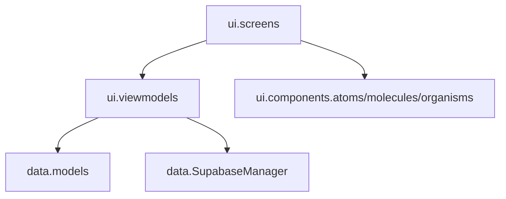
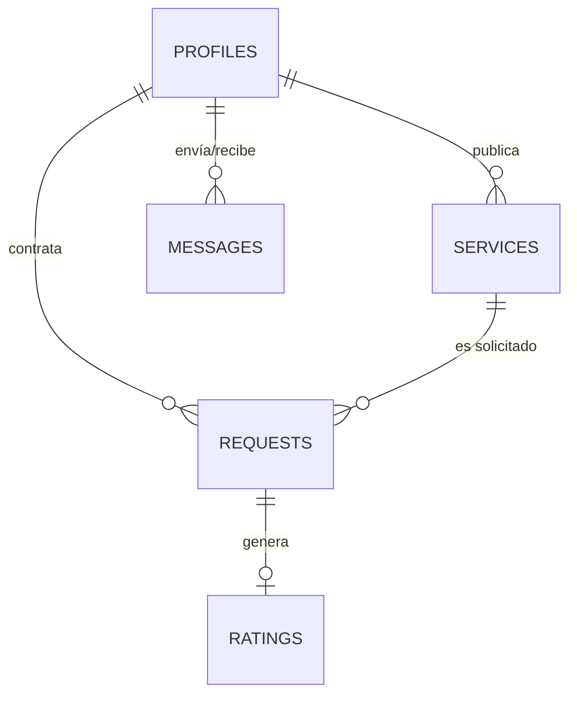

# Biblia Técnica de Ingeniería y Despliegue - YÁYA (v1.2.0 - versionCode 7)

Este documento constituye la fuente de verdad técnica para la plataforma **YÁYA**. Detalla la arquitectura, el modelado de datos, los estándares de codificación y los procedimientos de despliegue para garantizar la escalabilidad y mantenibilidad del sistema por parte de **BH++ Team**.

---

## 1. Arquitectura de Software: Clean MVVM + Atomic Design

YÁYA implementa una arquitectura robusta basada en la separación estricta de responsabilidades, permitiendo que la interfaz sea elástica y la lógica de negocio totalmente independiente.

### 1.1. Capas del Sistema (Package Structure)


*   **UI Layer (Stateless):** Funciones Composable puras que renderizan un `UiState`.
*   **ViewModel Layer:** Controladores de estado que gestionan corrutinas y transforman datos crudos en información lista para la vista (Principio DRY).
*   **Data Layer:** Integración directa con Supabase mediante el cliente global, gestionando Auth, Postgrest y Realtime.

### 1.2. Estructura de Módulos y Paquetes Principales
*   `com.bhplusplus.yaya.data.models`: Data classes de dominio serializables (`UserProfile`, `Category`, `Service`, `ServiceImage`, `Availability`, `ServiceRequest`, `Rating`, `Message`, `Report`).
*   `com.bhplusplus.yaya.utils`: Utilidades centralizadas DRY (`ValidationUtils`, `FormatterUtils`, `ImageUtils`, `TutorialManager`).
*   `com.bhplusplus.yaya.ui.components`: Componentes reutilizables bajo Atomic Design (`atoms`, `molecules`, `organisms`).
*   `com.bhplusplus.yaya.ui.screens`: Pantallas composables pasivas divididas por flujo funcional.
*   `com.bhplusplus.yaya.ui.viewmodels`: Controladores de estado con arquitectura Jetpack ViewModel y Kotlin Flows.

### 1.3. Arquitectura de Clases (MVVM Pattern)
Para cada pantalla, se implementa el siguiente flujo de componentes:

*   **UiState (Data Class):** Inmutable, representa el estado total de la pantalla.
*   **ViewModel (ViewModel):** Única fuente de verdad. Se comunica con el `SupabaseManager` y actualiza el `UiState`.
*   **Screen (Composable):** Recibe el `UiState` y emite eventos de usuario al ViewModel.
*   **Components (Composables):** Átomos y moléculas desacoplados que renderizan partes específicas del `UiState`.

### 1.4. Engine de Validaciones de Entrada (ValidationUtils - DRY)
El componente `ValidationUtils` centraliza las reglas de negocio para la captura y edición de datos de usuario en toda la aplicación:
*   **Nombres:** Letras latinas (incluyendo tildes y ñ), espacios y guiones. Sin dígitos numéricos.
*   **Documento DNI/CC:** Formato exclusivamente numérico entre 6 y 12 dígitos.
*   **Teléfono móvil:** Cadena de exactamente 10 dígitos numéricos.
*   **Correo Electrónico:** Formato estándar RFC/Patterns (`Patterns.EMAIL_ADDRESS`).
*   **Contraseña Segura:** Mínimo 8 caracteres combinando mayúscula, minúscula y número o carácter especial.
*   **Fecha de Nacimiento y Restricción de Edad Mínima (15 años):** Bloqueo en la UI de días futuros y fechas que no cumplan la edad mínima de 15 años en el calendario (`SelectableDates` con `LocalDate.now().minusYears(15)` en `RegisterUserScreen`), y validación de fecha cronológica de al menos 15 años cumplidos (`isValidBirthDate` con `!date.isAfter(today.minusYears(15))` en `ValidationUtils.kt`), presentando el mensaje de error amigable *"Debes tener al menos 15 años de edad para registrarte en YÁYA."*.
*   **Agendamiento de Citas:** Dirección de atención válida (mín. 5 caracteres), restricción UI de calendario a días presentes o futuros (`SelectableDates`), verificación de fecha no pasada (`isValidFutureDate`) y validación de hora no transcurrida para el día actual (`isValidScheduleTime`).
*   **Evaluación de Traslape Horario (`ValidationUtils.isTimeRangeOverlapping`):** Función estática de validación que evalúa si dos rangos temporales (`start1`-`end1` y `start2`-`end2`) se solapan entre sí, utilizada para evitar colisiones de agenda entre servicios de un mismo prestador.
*   **Validación de Publicación de Servicios (`CreateServiceViewModel.validateServiceData`):** Lógica pura de validación que analiza en tiempo real la integridad del servicio antes de su persistencia: requiere título (mín. 3 caracteres) y descripción no vacíos, precio > 0, secuencia horaria estricta (`startTime < endTime`), inclusión de todos los días seleccionados (`workingDays`) en la jornada maestra (`masterWorkingDays`), rango de horas contenido en los límites maestros (`masterStart` - `masterEnd`), y ausencia de traslapes con otros servicios del mismo prestador.
*   **Municipios y Cobertura:** Lista inmutable centralizada en `ValidationUtils.HUILA_MUNICIPALITIES` que suministra las opciones de municipios de cobertura en el departamento del Huila (La Plata, Nátaga, Paicol, Tesalia, Garzón, Neiva, Pitalito, Gigante) a componentes desplegables `ExposedDropdownMenuBox` en `RegisterUserScreen`, `EditProfileScreen`, `CreateServiceScreen` y al filtro geográfico de `HomeScreen`, eliminando errores de tipeo y campos de texto libre.
*   **Estandarización Iconográfica Material Design 3 en Formularios, Validaciones y Gestión de Horarios:** Sustitución total de emojis por componentes vectoriales nativos `Icon(Icons.AutoMirrored.Filled.ArrowBack)` e `Icon(Icons.AutoMirrored.Filled.ArrowForward)` y textos sobrios en los asistentes de Registro (`RegisterUserScreen.kt`), Creación de Servicios (`CreateServiceScreen.kt`) y la pantalla de Jornada Maestra / Mi Horario General (`AvailabilityScreen.kt` y `AvailabilityDayCard.kt`), garantizando sobriedad visual, espaciado atómico de `6.dp` a `8.dp` y alineación con los estándares iconográficos de Material Design 3.
*   **Zero Emojis Policy:** Queda terminantemente prohibido el uso de emojis en componentes de UI, tutoriales in-app, mensajes de moderación y descripciones de transacciones. Toda comunicación visual debe apoyarse en iconografía vectorial MD3 y redacción técnica profesional para mantener los estándares de diseño Senior de BH++.

### 1.5. Arquitectura de Filtrado Geográfico por Municipio/Zona, Flujo de Horarios, Reputación del Prestador y Módulo 1 de Administración
YÁYA implementa una estrategia de filtrado multizona, gestión elástica de tiempos de atención y un motor de reputación transparente para segmentar la oferta de servicios y exponer la valoración de los prestadores:
*   **Estandarización de Ubicación con `ExposedDropdownMenuBox`:** Los formularios de captura e interacción (`RegisterUserScreen`, `EditProfileScreen`, `CreateServiceScreen`) y el diálogo modal de filtro geográfico en `HomeScreen` consumen la lista inmutable `ValidationUtils.HUILA_MUNICIPALITIES`. Los campos de texto libre fueron reemplazados por selecciones desplegables inmutables con `ExposedDropdownMenuBox`, garantizando consistencia total en la base de datos y eliminando errores tipográficos.
*   **Modelos de Datos de Ubicación:** La propiedad opcional `municipality: String?` ("La Plata" por defecto) se integra en los modelos de dominio `UserProfile` y `Service`.
*   **Controles UI y Flujo de Inicialización Secuencial de Filtrado (`HomeViewModel`):**
    *   El componente `HomeTopBar` expone un chip interactivo de selección de municipio y `HomeViewModel.applyFilters()` filtra dinámicamente el catálogo reactivo permitiendo seleccionar municipios específicos o la opción global "Todos".
    *   *Sincronización Inicial de Municipio (`HomeViewModel.loadData`):* Para prevenir condiciones de carrera al iniciar la app, `HomeViewModel.loadData()` ejecuta una secuencia asíncrona strictly ordenada: recupera primero el perfil del usuario autenticado (`userProfile`) y actualiza el municipio seleccionado (`selectedMunicipality`) con la ubicación real configurada en su perfil (ej. "Nátaga") **antes** de ejecutar `applyFilters()`. Esto elimina la carga inicial filtrada por la ubicación predeterminada ("La Plata") y asegura que la vista principal despliegue inmediatamente los servicios acordes a la ubicación geográfica real del usuario sin requerir un refresco manual.
    *   *Optimización de Desplazamiento en Selector Modal de Municipios (`HomeScreen`):* El diálogo modal `AlertDialog` de selección de municipios en `HomeScreen` utiliza `LazyColumn(modifier = Modifier.fillMaxWidth().heightIn(max = 350.dp))` para presentar la lista unificada de municipios de cobertura (`ValidationUtils.HUILA_MUNICIPALITIES`). Esta implementación sustituye la estructura previa basada en `Column`, solucionando problemas de desbordamiento en pantallas pequeñas y garantizando un desplazamiento vertical fluido con acceso completo a la totalidad de municipios disponibles.
*   **Flujo de Auto-Login Inmediato e Onboarding Inteligente por Rol (Post-Registro):**
    *   **Auto-Login Inmediato (`RegisterUserViewModel.kt`):** Tras la creación exitosa del usuario en Supabase Auth y la inserción/upsert del perfil en `public.profiles`, `RegisterUserViewModel` ejecuta explícitamente `signInWith(Email)` para autenticar al usuario de forma automática e inmediata. Retorna el rol del usuario mediante el callback `onResult(success: Boolean, role: String)`.
    *   **Onboarding Diferenciado por Rol (`AppNavigation.kt`):** Al recibir la confirmación de registro y el rol registrado, `AppNavigation` realiza la redirección automática e inmediata según la naturaleza del perfil, limpiando la pila anterior de navegación (`popUpTo(WelcomeRoute)`):
        *   *Prestadores (`role == "provider"`):* Redirección directa hacia `AvailabilityRoute` (*"Mi Horario General"*), garantizando que todo nuevo prestador configure su Jornada Maestra inicial y días activos en `public.availability` antes de publicar servicios o recibir contrataciones.
        *   *Clientes (`role == "client"`):* Redirección directa hacia `HomeRoute` (*"Catálogo Principal"*), permitiéndole explorar de inmediato el catálogo de servicios de su municipio sin pasos ni inicios de sesión intermedios.
    *   **Regla de Navegación Defensiva en BackStack para Onboarding (`AppNavigation.kt`):** En flujos donde la pila de retroceso ha sido limpiada (*popped*) durante la redirección inicial de onboarding a `AvailabilityRoute`, la invocación a `navController.popBackStack()` al presionar el botón de regreso retornaría `false` por falta de pantallas previas. Se implementó una regla de navegación defensiva condicional en `composable<AvailabilityRoute>`: `if (!navController.popBackStack()) { navController.navigate(HomeRoute) { popUpTo(0) { inclusive = true } } }`. Si existe historial previo (acceso desde Perfil), desapila normalmente; si el BackStack está vacío (redirección desde Onboarding), navega proactivamente hacia `HomeRoute`.
*   **Rediseño del Formulario de Registro en 3 Pasos (Wizard de Registro - `RegisterUserScreen` & `RegisterUserViewModel`):**
    *   *Estructura del Wizard e Indicador de Progreso:* Asistente guiado e interactivo de registro en 3 pasos con encabezado de progreso gráfico (`LinearProgressIndicator` al 33% en Paso 1, 66% en Paso 2 y 100% en Paso 3) y etiquetas indicadoras de etapa ("PASO 1 DE 3: INFORMACIÓN PERSONAL Y ROL", "PASO 2 DE 3: CONTACTO Y UBICACIÓN", "PASO 3 DE 3: SEGURIDAD Y CONSENTIMIENTO LEGAL").
    *   *Paso 1 (Información Personal y Rol - Restricción de Edad Mínima de 15 Años - v1.2.0 / versionCode 7):*
        - **Campos:** Nombre Completo (`full_name`), Documento de Identidad / Cédula (`documentId`), Fecha de Nacimiento (`birthDate` DatePicker con restricción de 15 años) y Selección de Rol (*Cliente* vs *Prestador*) mediante tarjetas atómicas de selección (`Surface`/`OutlinedCard`).
        - **Validación de Avance y Regla de Edad Mínima (ValidationUtils.kt):** Se evalúa reactivamente en tiempo real mediante `isStep1Valid` (exige nombre alfabético sin dígitos, documento de 6 a 12 números, edad mínima de 15 años cumplidos evaluada por `ValidationUtils.isValidBirthDate` y rol seleccionado).
        - **Restricción Visual en UI:** El selector de calendario `DatePickerState` (`SelectableDates` en `RegisterUserScreen`) inhabilita fechas posteriores a `LocalDate.now().minusYears(15)`, proyectando el mensaje contextual *"Debes tener al menos 15 años de edad para registrarte en YÁYA."* ante elecciones inválidas.
    *   *Paso 2 (Contacto y Ubicación):*
        - **Campos:** Teléfono Celular (10 dígitos), Dirección de Residencia (`address` mín. 5 caracteres) y Municipio / Ciudad del Huila (`municipality` via `ExposedDropdownMenuBox` sincronizado con `ValidationUtils.HUILA_MUNICIPALITIES`).
        - **Validación de Avance:** Se evalúa reactivamente en tiempo real mediante `isStep2Valid` (exige teléfono de 10 dígitos, dirección válida y municipio seleccionado).
    *   *Paso 3 (Seguridad y Consentimiento Legal):*
        - **Campos:** Correo Electrónico (`email` RFC/Patterns), Contraseña Segura (`password` mín. 8 caracteres) y Aceptación de Términos & Condiciones y Políticas de Privacidad (`acceptTerms` Checkbox).
        - **Validación de Registro:** Se evalúa reactivamente mediante `isStep3Valid` (exige correo válido, clave segura y consentimiento aceptado) para habilitar el botón principal de *"Registrarse"*.
    *   *Arquitectura MVVM Puro y Vista Pasiva:*
        - **Gestión de Navegación y Validaciones (`RegisterUserViewModel.kt`):** El ViewModel administra `currentStep` (`mutableIntStateOf`), expone la función de control de flujo `goToStep(step)` y las funciones de validación parcial reactivas `isStep1Valid`, `isStep2Valid` e `isStep3Valid`.
        - **Vista Declarativa Pasiva (`RegisterUserScreen.kt`):** Componente composable sin lógica de estado local que renderiza el bloque activo correspondiente según `currentStep` con botones de navegación *"Siguiente"* / *"Volver"* y el botón de envío final.
*   **Carga Inteligente de Disponibilidad y Prevención de Traslapes de Días:**
    *   **Consulta de Disponibilidad y Servicios Existentes:** `CreateServiceViewModel` ejecuta `loadProviderAvailabilityAndServices(currentEditingServiceId)` para recuperar de manera concurrente la jornada maestra del prestador (`masterWorkingDays`) y los servicios activos creados previamente (`public.services`), construyendo un mapa de ocupación `occupiedDaysByOtherServices: Map<Int, String>` que concatena el título del servicio con su rango horario `(start_time - end_time)` activo (ej. `Desarrollo de aplicaciones móviles (08:00 - 18:00)`).
    *   **Acción Rápida *"Cargar mi jornada maestra"*:** Permite precargar instantáneamente en el estado UI `selectedDays` los días configurados en la disponibilidad general del prestador.
    *   **Matriz Tabular de Agenda de Servicios Ocupados ("Agenda de tus Otros Servicios Activos"):** Sustitución del párrafo largo de texto informativo por una tarjeta contenedora atómica formateada con matriz tabular (`Surface` por día con badge `[Lunes]` e intervalo de horario ocupado `06:00 AM - 06:00 PM`). Este componente permite al prestador identificar en medio segundo qué días y horas tiene ocupados por sus otros servicios activos y qué franjas tiene libres para ofertar y programar su disponibilidad.
*   **Rediseño del Formulario de Creación de Servicios en 2 Pasos (Wizard de Creación - `CreateServiceScreen` & `CreateServiceViewModel`):**
    *   *Estructura del Wizard e Indicador de Progreso:* Asistente interactivo guiado en 2 pasos con encabezado de progreso gráfico (`LinearProgressIndicator` al 50% en Paso 1 y al 100% en Paso 2) y etiquetas indicadoras de etapa ("PASO 1 DE 2: INFORMACIÓN BÁSICA" / "PASO 2 DE 2: PRECIO Y HORARIOS").
    *   *Paso 1 (Información Básica y Portafolio):*
        - **Campos:** Categoría (`ExposedDropdownMenuBox`), Municipio de atención del Huila (`ExposedDropdownMenuBox` sincronizado con `ValidationUtils.HUILA_MUNICIPALITIES`), Título del servicio (`OutlinedTextField`), Descripción detallada (con minHeight de 120dp) y Portafolio de imágenes (`PickMultipleVisualMedia` con precarga y contador).
        - **Validación de Avance:** El botón *"Siguiente: Precio y Horarios ➔"* se activa dinámicamente solo cuando `isStep1Valid` es verdadero (título, descripción, categoría y municipio no vacíos).
    *   *Paso 2 (Precio, Duración, Disponibilidad y Materiales):*
        - **Precio Base:** Campo de texto numérico para el costo del servicio en COP.
        - **Duración Estimada Estructurada en 1 Línea Horizontal (Spacious Duration Field):** Control compuesto en `Row(Modifier.fillMaxWidth())` que combina la cantidad numérica (`OutlinedTextField`) con el selector de unidades (`ExposedDropdownMenuBox`), disponiendo de espacio para desplegar unidades de medida (`Horas`, `Minutos`, `Días`, `Meses`, `Años`) en una sola línea clara sin envolver caracteres verticalmente.
        - **Insumos/Materiales:** Checkbox con campo condicional para especificar el costo extra de materiales no incluidos.
        - **Días y Horarios de Atención:** Selector de días (`FlowRow`) con botón *"Cargar mi jornada maestra"*, matriz tabular de agenda ocupada por otros servicios y detector de traslapes, junto con la selección de hora inicio y hora fin mediante las píldoras de tiempo atómicas `TimeSelectorPill` conectadas a `YayaTimePickerDialog`.
        - **Navegación y Guardado:** Botón *"⬅️ Volver"* para regresar al Paso 1 y botón de publicación validado reactivamente con `currentValidationError`.
*   **Control Compuesto Horizontal de Duración Estimada Estructurada (`CreateServiceScreen`):**
    *   *Composición UI de Ancho Amplio:* Estructura en `Row(Modifier.fillMaxWidth())` con proporciones equilibradas donde el `OutlinedTextField` limita la entrada a dígitos numéricos (`isDigit()`) y el `ExposedDropdownMenuBox` expone la lista inmutable de unidades (`Horas`, `Minutos`, `Días`, `Meses`, `Años`) desplegadas en una sola línea horizontal.
    *   *Serialización y Parsing:* La variable calculada `combinedEstimatedTime = "$estimatedTimeNumber $estimatedTimeUnit"` consolida la cadena estructurada (ej. `"2 Horas"`) para persistencia en Supabase PostgreSQL (`public.services.estimated_time`). En la carga para edición (`loadServiceData`), el ViewModel realiza el parsing inteligente mediante `substringBefore(" ")` y `substringAfter(" ")` para restaurar separadamente la cantidad y la unidad en la interfaz.
*   **Estandarización y Reutilización Atómica del Control de Hora (`YayaTimePickerDialog` & `TimeSelectorPill` en `CreateServiceScreen`):**
    *   Sustitución de los campos de texto libre `OutlinedTextField` de hora inicio y hora fin por las píldoras de tiempo atómicas `TimeSelectorPill` conectadas al diálogo modal `YayaTimePickerDialog` en el Paso 2 de la creación de servicios (`CreateServiceScreen.kt`).
    *   Esta estandarización unifica el control de selección horaria a lo largo de toda la plataforma (`AvailabilityScreen`, `ContratacionScreen` y `CreateServiceScreen`), garantizando consistencia de la experiencia de usuario (UX/UI), prevención de errores de formato manual y máxima reutilización de componentes atómicos (DRY).
*   **Desacoplamiento MVVM Puro y Gestión Centralizada del Wizard en `CreateServiceViewModel.kt`:**
    *   *Administración de Estados de Navegación y Formulario:* El ViewModel administra centralizadamente la navegación por pasos `currentStep` (`mutableIntStateOf`), las variables de duración compuesta `estimatedTimeNumber`, `estimatedTimeUnit`, la lista inmutable `timeUnits`, y la propiedad computada `combinedEstimatedTime` (`"$estimatedTimeNumber $estimatedTimeUnit"`).
    *   *Métodos de Navegación y Validación:* Exposición del método de navegación `goToStep(step)`, la validación reactiva del paso 1 `isStep1Valid(...)` (que verifica título, descripción, categoría y municipio) y la rutina de parsing inteligente `parseEstimatedTime(rawTime)` para desacoplar el formateo durante la edición.
    *   *Vista 100% Declarativa y Pasiva (`CreateServiceScreen.kt`):* La interfaz de usuario se desacopla por completo de la lógica de control y estados locales del wizard, actuando como una vista declarativa pura que observa el estado del ViewModel y reacciona a eventos de interacción según los principios de Atomic Design.
*   **Separación entre Disponibilidad Maestra y Horarios por Servicio:**
    *   **Jornada Maestra del Prestador (`public.availability`):** Define el rango horario global (hora de inicio y hora de fin) y días laborables generales configurados por el usuario prestador en su perfil general.
    *   **Horarios por Servicio (`public.services`):** Especifica los días de atención (`working_days`) y particularidades aplicables de manera independiente a cada servicio o talento publicado.
    *   **Validaciones Estrictas Previa al Guardado (`CreateServiceViewModel`):** Antes de crear o actualizar un servicio en `public.services`, se aplica un algoritmo defensivo en tres fases:
        1. *Secuencia Horaria:* Exige que la hora de inicio (`startTime`) sea strictly menor a la hora de fin (`endTime`).
        2. *Conformidad con la Jornada Maestra:* Verifica que todos los días asignados (`workingDays`) pertenezcan a la jornada maestra del prestador y que el rango horario (`startTime` - `endTime`) esté contenido entre `masterStart` y `masterEnd` para cada día correspondiente.
        3. *Evaluación de Solapamiento Horario:* Si el prestador ya posee otros servicios activos compartiendo días de trabajo, se evalúa si colisionan con el rango propuesto mediante `ValidationUtils.isTimeRangeOverlapping`. Ante un traslape, se deniega el guardado y se notifica el conflicto específico (ej. *"Conflicto de horario el Lunes: Ya tienes el servicio 'Servicio X' de 08:00 a 14:00"*).
    *   **Deshabilitación Visual de Días y Control Reactivo de Guardado (`CreateServiceScreen`):**
        - *Deshabilitación de Días no Laborables (`FlowRow`):* Los días que no forman parte de la jornada maestra del prestador (`masterWorkingDays`) se deshabilitan visualmente en la UI (`alpha = 0.3f`) y se desacoplan del click (`clickable(enabled = false)`), impidiendo que el usuario seleccione días fuera de su disponibilidad maestra.
        - *Evaluación Reactiva `currentValidationError`:* La interfaz calcula en tiempo real `currentValidationError` utilizando `remember(...)` sobre `validateServiceData`. Ante inconsistencias (días no incluidos en la jornada maestra, rango de horas fuera del marco maestro, `startTime >= endTime` o traslape con otros servicios del prestador), se muestra de inmediato un banner descriptivo de error en la pantalla y el botón *"Publicar Servicio / Guardar Cambios"* permanece estrictamente deshabilitado (`enabled = !isLoading && currentValidationError == null`).
    *   **Validación Sincronizada en Agendamiento (`ContratacionViewModel`):** Al iniciar un proceso de contratación, `ContratacionViewModel` intercepta el calendario y horario de la cita: restringe los días seleccionables a aquellos habilitados para el servicio específico (`currentService.working_days`) y valida que la hora propuesta coincida con el rango activo en la tabla `availability`, bloqueando selecciones fuera de rango o en horas pasadas.
    *   **Resiliencia de Perfil en Contratación (`ensureProfileExists`):** Al ejecutar la acción de contratación (`contratar`), `ContratacionViewModel` ejecuta la función atómica `ensureProfileExists(user)` antes de realizar la inserción (`insert`) en la tabla `requests`. Esta rutina verifica si el usuario autenticado posee un registro en `public.profiles`; si no existe (escenario que originaba la violación de clave foránea `requests_client_id_fkey` / PostgreSQL Code `23503`), recupera automáticamente la metadata de Auth (`full_name`, `role`, `phone`, `address`, `municipality`) e inserta el perfil faltante en `public.profiles` previo a la creación de la solicitud, garantizando la eliminación del error 23503 y la resiliencia del proceso de contratación.
    *   **Resolución de Persistencia, Serialización y Formateo SQL (`AvailabilityViewModel` & `Availability.kt`):** Corrección del fallo de guardado en `public.availability` mediante la generación de UUIDs de cliente (`java.util.UUID.randomUUID()`) previa a la operación de `upsert`, resolviendo la restricción not-null en la columna `id` de Supabase PostgreSQL (evitando el envío de `"id": null`). Se removieron además los valores por defecto en las propiedades de `Availability.kt` (`day_of_week`, `provider_id`, `start_time`, `end_time`) para impedir que `kotlinx.serialization` omita campos en el payload JSON cuando coinciden con sus valores por defecto, solucionando la excepción `null value in column "day_of_week" violates not-null constraint`. Asimismo, se normalizó el formato de las horas a 8 caracteres (`"HH:mm:ss"`, ej. `"08:00:00"`), asegurando alineación estricta con el tipo SQL `time without time zone` y desplegando errores contextuales en `AvailabilityScreen` mediante un contenedor visual dedicado.
*   **Rediseño UI/UX 3.0 de la Jornada Maestra / Mi Horario General (Vista Compacta 100% Sin Scroll en `AvailabilityScreen`, `AvailabilityDayCard`, `ExecutiveScheduleBanner` & `AvailabilityViewModel`):**
    *   *Vista Compacta de 7 Días en Una Sola Pantalla (`AvailabilityScreen.kt` & `AvailabilityDayCard.kt`):* Rediseño de las tarjetas de días hacia filas atómicas de alta densidad (`Row` de 44dp de altura por día) separadas por divisiones suaves (`HorizontalDivider`). Todos los 7 días de la semana (Lunes a Domingo) se despliegan e interactúan en una sola tarjeta contenida dentro de la pantalla, garantizando una experiencia fluida de cero desplazamiento (*Zero Scroll*).
    *   *Banner Resumen e Indicadores de Carga Horaria (`ExecutiveScheduleBanner` & `AvailabilityViewModel.kt`):* Tarjeta superior ejecutiva que calcula y expone de forma reactiva en `AvailabilityViewModel` el número de días laborables activos (`activeDaysCount`) y la carga horaria semanal total computada en horas (`totalWeeklyHours`), sumando las franjas entre `start_time` y `end_time` para cada día activo.
    *   *Barra de Atajos de Configuración Rápida en 1 Clic (Quick Presets):* Implementación de una barra atómica de accesos rápidos con `FilterChip` (*"💼 Lunes a Viernes"*, *"📅 Todos los Días"*, *"🧹 Limpiar"*), conectada directamente a los métodos de asignación masiva `applyPresetMonToFri()`, `applyPresetAllDays()` y `clearAllDays()` en `AvailabilityViewModel`, agilizando la configuración de la jornada laboral en un solo toque.
    *   *Rediseño Atómico de `AvailabilityDayCard`:* Presentación adaptativa del estado del día laborable (`is_active`). Días activos resaltados con borde en color primario `RedPrimary`, badge de estado `[🟢 ACTIVO]` y las pills de selección horaria interconectadas con una flecha direccional `[ 08:00 AM ] ➔ [ 06:00 PM ]`. Días inactivos presentados con badge `[⚪ DESCANSO]` e inputs de hora ocultos para maximizar la pulcritud visual y la claridad interactiva en filas compactas de 44dp.
    *   **Refinamiento Semántico y Correspondencia Visual de `ServiceCard`:**
        - *Reubicación de `RatingIndicator`:* La estrella y promedio de calificaciones se reubicaron en la cabecera de la tarjeta (`ServiceCard`), situándose directamente debajo del nombre del prestador (`state.domain.provider?.full_name`).
        - *Alineación con Reputación en `public.ratings`:* Esta distribución alinea visualmente la interfaz con la tabla relacional `public.ratings`, la cual evalúa la reputación del talento (`provider_id`). Se elimina así la ambigüedad semántica previa donde la calificación aparentaba pertenecer al servicio individual.
        - *Reorganización de Footer:* La categoría del servicio y el indicador de días de disponibilidad se reubicaron en el pie de página de la tarjeta (`ServiceCard`) para mantener una clara jerarquía visual y facilitar la lectura.
*   **Consulta y Visualización de Reputación y Reseñas del Prestador (`public.ratings` -> `ProfileViewModel` & `ProfileScreen`):**
    *   *Consulta y Cálculo de Reputación (`ProfileViewModel.fetchProviderRatings`):* Ejecuta la consulta a la tabla `public.ratings` de Supabase Postgrest filtrando por `provider_id` igual al ID del usuario autenticado. Calcula el promedio de estrellas (`averageRating`), el total de opiniones recibidas (`totalRatings`) y mantiene la lista ordenada de valoraciones (`providerRatings`).
    *   *Despliegue en Cabecera Hero (`ProfileHeroHeader`):* Para usuarios con rol `provider` o `admin`, la cabecera del perfil integra dinámicamente la molécula `RatingIndicator` desplegando el promedio visual de estrellas y el conteo de reseñas junto al badge de rol.
    *   *Sección "MI TALENTO" y Modal de Reseñas (`ProfileScreen` & `ProfileOptionItem`):* Adición de la opción *"Mi Reputación y Reseñas"* en el bloque de gestión de talento. Utiliza la propiedad `badgeText` en `ProfileOptionItem` para renderizar el resumen numérico (ej: `"4.9 (18)"` o `"Sin opiniones"`). Al pulsar la opción, despliega un `ModalBottomSheet` con la lista completa de comentarios y calificaciones del prestador (`YayaRatingItem`), brindando retroalimentación transparente al prestador sobre la percepción de sus servicios.
*   **Visor del Manual de Uso Integrado en la App con Segregación Estricta por Rol (`ManualConstants`, `LegalViewerScreen`, `AppNavigation`, `ProfileScreen`):**
    *   *Objeto `ManualConstants` y Lógica de Segregación Dinámica (`ManualConstants.getManualContentForRole(role)`):* Encapsula las constantes inmutables de manuales segregadas por rol (`CLIENT_ROLE_MANUAL_CONTENT`, `PROVIDER_ROLE_MANUAL_CONTENT`, `ADMIN_ROLE_MANUAL_CONTENT`) redactadas en formato Markdown formal sin emojis (estilo legal/técnico):
        - **Cliente (`role == "client"`):** Manual enfocado en búsqueda por municipio, agendamiento futuro inteligente, negociación "Handshake", chat y calificaciones.
        - **Prestador (`role == "provider"`):** Manual que integra funciones de cliente con gestión de talentos, asignación de municipio de cobertura, jornada maestra, detector de traslapes y consulta de reputación en perfil.
        - **Administrador (`role == "admin"`):** Manual maestro de administración que abarca auditoría de publicaciones, semáforo disciplinario de reportes (Amarillo/Naranja/Rojo), llamados de atención automáticos vía chat y la capa de anonimato protegido "Equipo de Moderación YÁYA".
    *   *Resolución Dinámica de Rol en `AppNavigation.kt` (`UserManualRoute`):* En el destino `composable<UserManualRoute>`, se consulta asíncronamente el rol activo (`activeRole`) desde el perfil Supabase Postgrest (`profiles.role`) con fallback a `userMetadata["role"]`. Dinámicamente se parametriza `LegalViewerScreen` asignando el título adaptativo:
        - `"Manual para Clientes"` para el rol de cliente.
        - `"Manual para Prestadores"` para el rol de prestador.
        - `"Manual Maestro de YÁYA"` para el rol de administrador.
        Y el contenido correspondiente invocado mediante `ManualConstants.getManualContentForRole(activeRole)`.
    *   *Visor Inmersivo `LegalViewerScreen`:* Componente atómico reutilizable que recibe el título dinámico por rol y el contenido procesado en Markdown, con soporte de scroll, jerarquía tipográfica formal y acción de retorno.
    *   *Punto de Entrada en `ProfileScreen`:* Opción "Manual de Uso de la App" en el menú de perfil con icono `Icons.AutoMirrored.Filled.MenuBook` (`onUserManual = { navController.navigate(UserManualRoute) }`), permitiendo la lectura inmersiva y segregada directamente en la app.
*   **Arquitectura del Rediseño UI/UX 2.0 de la Pantalla de Perfil (`ProfileScreen`, `ProfileHeroHeader`, `ProfileOptionItem`):**
    *   *Hero Header 2.0:* Integración de un botón flotante de edición/lápiz (`IconButton Icons.Default.Edit`) en la esquina superior derecha del encabezado `ProfileHeroHeader`. Esta optimización elimina la necesidad de contar con un botón extenso de "Editar Perfil" en la lista de opciones, consolidando las acciones de perfil en el área superior.
    *   *Tarjetas de Acceso Rápido (Quick Action Cards):* Fila de 3 tarjetas compactas organizadas en grid horizontal para usuarios con rol de prestador o administrador (*Mis Servicios*, *Solicitudes* con badge flotante en color rojo que indica solicitudes pendientes, y *Reputación* con promedio numérico e indicador ⭐ 4.9).
    *   *Navegación por Pestañas Segmentadas (`TabRow`):* Segmentación modular y limpia de las 14 opciones de perfil en un control `TabRow` de 2 pestañas:
        - **Pestaña 1 ("💼 Mi Operación"):** Agrupa la operatividad diaria del usuario (Horario de trabajo, servicios publicados, solicitudes recibidas, mis pedidos, mensajes y acceso al panel administrativo).
        - **Pestaña 2 ("⚙️ Ajustes y Ayuda"):** Agrupa la configuración de seguridad, soporte e información institucional (Cambio de contraseña, Manual de uso de la app, Términos y Condiciones, Política de Privacidad, Borrado de cuenta y Cerrar sesión).
*   **Matriz de Facultades y Restricciones por Rol (Cuenta Universal):** Definición formal de permisos para el modelo de cuenta única, asegurando la segregación operativa y el cumplimiento legal:
    *   **Rol Cliente:** Facultad exclusiva para búsqueda local por municipio, exploración de categorías, negociación Handshake, contratación de servicios, gestión de pedidos propios, chat y sistema de calificaciones. No posee acceso a herramientas de publicación o gestión de agenda.
    *   **Rol Prestador (Perfil Híbrido):** Habilitado para la publicación de talentos, carga de jornada maestra, gestión de agenda de servicios, detector de traslapes y visualización de reputación ⭐. Mantiene el 100% de las facultades del Rol Cliente, permitiendo la contratación de servicios de terceros sin requerir cambio de cuenta.
    *   **Rol Administrador:** Acceso al Panel Maestro de Auditoría, moderación con semáforo disciplinario, gestión directa de usuarios (suspensión/reactivación/eliminación) y capa de anonimato protegido para intervenciones de soporte.
*   **Norma de Accesibilidad, Contraste de Color y Adaptabilidad a Tema Oscuro (`LoginScreen` & `RegisterUserScreen`):**
    *   *Inhabilitación de Colores Oscuros Estáticos:* Queda estrictamente prohibido fijar colores oscuros o de baja luminancia (como `NavyBlue` `#1E2A38` asignado a `secondary`) en textos o enlaces que se renderizan sobre superficies variables o fondos en Tema Oscuro.
    *   *Optimización del Enlace de Recuperación de Clave (`LoginScreen`):* El enlace *"¿Olvidaste tu contraseña?"* se configuró con `MaterialTheme.colorScheme.primary` (`RedPrimary` con `FontWeight.Bold`), garantizando visibilidad y legibilidad del 100% en Tema Claro y Tema Oscuro (Deep Midnight).
    *   *Soporte Dinámico con `MaterialTheme.colorScheme.onBackground` (`RegisterUserScreen`):* Las etiquetas de los roles (*"Quiero contratar un servicio"*, *"Quiero ofrecer un talento"*) y las filas de consentimiento legal (`LegalConsentRow`) especifican explícitamente `color = MaterialTheme.colorScheme.onBackground`, garantizando la inversión tipográfica automática (texto blanco/slate azulado en Tema Oscuro y texto oscuro en Tema Claro).
    *   *Rediseño de Tarjetas de Rol:* Sustitución de los RadioButton sueltos por Tarjetas Atómicas de Selección (`Surface` / `OutlinedCard`) con borde en color primario (`MaterialTheme.colorScheme.primary`) al ser seleccionadas, mejorando el área táctil y la jerarquía de interacción.
*   **Confirmación Atómica de Cierre de Sesión en Barra Inferior (`HomeScreen` & `YayaConfirmationDialog`):**
    *   *Protección Antiacidentes y Reutilización de Componentes Atómicos:* Reutilización de la molécula `YayaConfirmationDialog` en la barra inferior de navegación de `HomeScreen` al accionar el botón de cerrar sesión.
    *   *Flujo de Confirmación Activa:* Despliegue del diálogo modal de confirmación atómica que intercepta la acción de salida, solicitando la confirmación activa e intencional del usuario antes de proceder a desautenticar la sesión en Supabase Auth y limpiar el estado activo, previniendo salidas accidentales por toques involuntarios en la barra inferior.
*   **Sincronización Defensiva Automática de Perfiles (`auth.users -> public.profiles`) en Registro y Login (`RegisterUserViewModel` & `LoginViewModel`):**
    *   *Flujo de Registro (`RegisterUserViewModel`):* La invocación a `signUpWith(Email)` de `supabase-kt` retorna directamente el objeto `UserInfo?` que contiene la propiedad `userResponse?.id` (el UUID generado en `auth.users`). Al extraer `userResponse?.id` directamente de la respuesta de `signUpWith`, el sistema ya no depende de que el usuario haya iniciado sesión o verificado su correo electrónico para obtener su UUID, permitiendo realizar la inserción e `upsert` inmediata del perfil en `public.profiles` (`postgrest["profiles"].upsert(newProfile)`) con la metadata inicial (`full_name`, `role`, `phone`, `address`, `municipality`), sin importar si el rol es `client`, `provider` o `admin`.
    *   *Flujo de Autenticación Defensiva en Login (`LoginViewModel`):* Al iniciar sesión (`login`), la rutina atómica `ensureProfileExists(user)` consulta la existencia del perfil en `public.profiles`. Si la fila no existe (por ejemplo, en cuentas creadas sin triggers automáticos de DB), extrae la metadata de Supabase Auth (`full_name`, `role`, `phone`, `address`, `municipality`) e inserta automáticamente la fila en `public.profiles`, garantizando la sincronización inmediata del perfil en Postgrest.
*   **Validación Estricta del Parámetro `role` e Indicador Visual Contextual de Rol (`RegisterUserViewModel` & `RegisterUserScreen`):**
    *   *Validación Estricta de Dominios de Rol (`RegisterUserViewModel`):* El parámetro `role` enviado durante la solicitud de registro es inspeccionado y validado de forma defensiva en `RegisterUserViewModel`, restringiendo su dominio strictly a valores válidos autorizados (`client`, `provider`, `admin`). Esta verificación descarta de manera preventiva solicitudes con roles vacíos, no inicializados o malformados antes de interactuar con Supabase Auth y Postgrest.
    *   *Feedback Visual Contextual de Rol Seleccionado (`RegisterUserScreen`):* Se incorporó un indicador textual dinámico y permanente en la cabecera del selector de rol (*"Rol: Cliente"* / *"Rol: Prestador"*), ofreciendo retroalimentación visual clara e inmediata sobre la opción activa en el flujo de registro.
*   **Verificación Previa de Cédula/Documento (Pre-flight Check) y Mapeo Amigable de Errores (`RegisterUserViewModel.kt`):**
    *   *Verificación Pre-flight de Documento de Identidad:* Antes de invocar Supabase Auth (`signUpWith`), el ViewModel ejecuta una consulta previa (*Pre-flight Check*) a `public.profiles` verificando si el `document_id` ya se encuentra registrado. Si la cédula existe, detiene de inmediato el proceso notificando: *"Este número de cédula o documento ya está registrado con otra cuenta."*, evitando la creación de usuarios huérfanos en `auth.users` ante documentos duplicados.
    *   *Mapeo Amigable de Errores Postgrest y Auth:* Mapeo defensivo de excepciones PostgreSQL `Code 23505` (`profiles_document_id_key`) y errores de autenticación Auth (`already registered` / `User already registered`) a mensajes claros en español (*"Este correo electrónico ya está registrado. Intenta iniciar sesión."*), erradicando por completo mensajes técnicos crudos o trazas de base de datos en la interfaz de usuario.
*   **Regla de Serialización Estricta de Data Classes de Supabase en Kotlin (`UserProfile.kt`):**
    *   *Diagnóstico del Error PostgreSQL 23502:* En `UserProfile.kt`, la propiedad `role: String = "client"` poseía un valor por defecto. Durante el registro con rol `client`, `kotlinx.serialization` detectaba que el valor coincidía con el predeterminado y omitía la clave `"role"` del cuerpo JSON codificado enviado en la petición POST de Postgrest (`columns=id,full_name,phone,document_id,birth_date,address`). Al llegar a PostgreSQL sin la columna `role`, la base de datos abortaba la transacción arrojando la excepción `Code: 23502` (`null value in column "role" of relation "profiles" violates not-null constraint`).
    *   *Regla Arquitectónica y Solución:* Se removieron los valores por defecto de las propiedades no nulas `id`, `full_name` y `role` en `UserProfile.kt`. En toda data class de Kotlin que represente una entidad de Postgrest, las propiedades no nulas asociadas a columnas SQL con restricción `NOT NULL` sin valor `DEFAULT` en PostgreSQL **no deben declarar valores por defecto en Kotlin**. Esto obliga a `kotlinx.serialization` a incluir explícitamente el campo en cada payload JSON de HTTP POST/UPSERT, garantizando que PostgreSQL reciba `"role": "client"` o `"role": "provider"`.
*   **Arquitectura del Motor Atómico de Tutoriales In-App (*ShowOnce Tutorial Overlay System*):**
    *   *Propósito y Concepto:* Sistema guiado e inmersivo de onboarding y contextualización in-app que presenta tutoriales interactivos paso a paso en pantallas estratégicas de la aplicación, garantizando que cada guía se muestre exactamente una vez (*ShowOnce*) por usuario para no interferir con la experiencia de uso recurrente.
    *   *Flujo de Ejecución e Interacción (`TutorialManager -> YayaTutorialTooltip -> YayaTutorialOverlay`):*
        1. **Gestor de Persistencia `TutorialManager.kt` (`utils/`):** Utiliza `SharedPreferences` para verificar el estado de cada tutorial mediante claves estandarizadas de dominio (`TUTORIAL_HOME_MUNICIPIO`, `TUTORIAL_CREATE_SERVICE_STEP1`, `TUTORIAL_CREATE_SERVICE_STEP2`, `TUTORIAL_CONTRATACION_HANDSHAKE`, `TUTORIAL_PROFILE_REPUTATION`, `TUTORIAL_AVAILABILITY_MASTER`, `TUTORIAL_MY_SERVICES`, `TUTORIAL_INCOMING_REQUESTS`, `TUTORIAL_SERVICE_DETAIL`). Si la clave indica que el tutorial ya fue visto o completado (`isTutorialCompleted`), la capa de presentación omite automáticamente la renderización del overlay.
        2. **Molécula `YayaTutorialTooltip.kt` (`ui/components/molecules/`):** Tarjeta flotante con diseño atómico que encapsula el contenido explicativo de cada paso. Incluye título contextual, descripción, indicador visual de avance por páginas (`PageIndicator`), y botones de acción primarios/secundarios (*"Siguiente"* / *"Omitir"*).
        3. **Organismo `YayaTutorialOverlay.kt` (`ui/components/organisms/`):** Componente modal inmersivo que proyecta una máscara translúcida con oscurecimiento del 75% (`Color.Black.copy(alpha = 0.75f)`) sobre el árbol de UI. Administra el estado de la secuencia por pasos (`currentStep`), renderiza la molécula `YayaTutorialTooltip` ajustando su posición y notifica a `TutorialManager` para marcar la clave como completada al finalizar la secuencia o al presionar *"Omitir"*.
        4. **Efecto Spotlight con Recorte Transparente e Anillo de Luz (`YayaTutorialOverlay.kt` - Extensión Global 100% en 8 Pantallas):**
           - *Compositing Strategy y BlendMode.Clear:* En `YayaTutorialOverlay.kt`, el `Canvas` utiliza `graphicsLayer { compositingStrategy = CompositingStrategy.Offscreen }` para crear una capa gráfica independiente. Sobre esta capa se dibuja el fondo translúcido y posteriormente se aplica un `drawRoundRect` con `BlendMode.Clear` sobre `targetBounds`, perforando la máscara para exponer el componente subyacente con 100% de transparencia.
           - *Anillo de Luz (`Light Ring`):* Se traza un contorno delimitador brillante alrededor de `targetBounds` utilizando `MaterialTheme.colorScheme.primary` y un ancho de línea `Stroke(3.dp)` para crear un halo de iluminación focal sobre la zona de interacción.
           - *Arquitectura de Transición Spotlight Multi-Paso:* `YayaTutorialOverlay` administra el ciclo de vida de la guía secuencial vinculando cada elemento de la lista `steps` con sus coordenadas `targetBounds` dinámicas. Al avanzar de paso (`currentStep++`), el motor recalcula el recorte transparente e Anillo de Luz de manera fluida hacia las nuevas coordenadas del componente objetivo correspondiente, garantizando una transición visualmente natural.
           - *Ajuste Milimétrico de Recortes con `TutorialStep`:* La estructura del modelo `TutorialStep` admite los parámetros `targetCornerRadius: Dp` (con valor predeterminado de `12.dp`) y `targetPadding: Dp` (con valor predeterminado de `4.dp`). Estos parámetros permiten personalizar con precisión milimétrica el radio de curvatura de las esquinas y el margen/sangría de recorte alrededor del componente objetivo para componentes específicos, como el campo interno de `SearchBarIntegrated` (configurado con `targetCornerRadius = 16.dp` y `targetPadding = 2.dp`).
           - *Captura e Iluminación Multi-Objetivo 100% via `onGloballyPositioned` en las 8 Pantallas:*
             * **`HomeScreen`:** Paso 1 (Chip de Municipio `municipalityBounds`), Paso 2 (Foto de Perfil `profileIconBounds` via `onProfileIconPositioned` en `HomeTopBar.kt`), Paso 3 (Icono de Chat Directo `chatIconBounds`), Paso 4 (Icono de Notificaciones y Solicitudes `notificationsIconBounds`), Paso 5 (Barra de Búsqueda Integrada `searchBarBounds`), Paso 6 (Selector de Categorías `categorySelectorBounds`), Paso 7 (Primera Tarjeta de Servicio `firstServiceCardBounds` capturada mediante `itemsIndexed` e `index == 0`), Paso 8 (Botón Flotante "+" `fabBounds`) (`TUTORIAL_HOME_MUNICIPIO`).
             * **`ProfileScreen`:** Paso 1 (Navegación por Pestañas `TabRow`), Paso 2 (Tarjetas de Acceso Rápido `QuickActionCards`), Paso 3 (Encabezado y Reputación en `ProfileHeroHeader`) (`TUTORIAL_PROFILE_REPUTATION`).
             * **`CreateServiceScreen`:** Paso 1 del Wizard (Municipio de Cobertura e Información Básica via `TUTORIAL_CREATE_SERVICE_STEP1`) y Paso 2 del Wizard (Días de Atención en `FlowRow` y Rango Horario/Traslapes via `TUTORIAL_CREATE_SERVICE_STEP2`) sincronizados dinámicamente con `viewModel.currentStep`.
             * **`ContratacionScreen`:** Paso 1 (Dirección de Atención `addressBounds`), Paso 2 (Selectores de Fecha/Hora), Paso 3 (Negociación Handshake en `PriceNegotiator`) (`TUTORIAL_CONTRATACION_HANDSHAKE`).
             * **`AvailabilityScreen`:** Paso 1 (Banner Resumen de Carga Horaria `summaryBannerBounds`), Paso 2 (Barra de Atajos de Configuración en 1 Clic `presetsBarBounds`), Paso 3 (Tabla Compacta de Días Hábiles `daysListBounds`), Paso 4 (Botón Primario Guardar Cambios `saveButtonBounds`) (`TUTORIAL_AVAILABILITY_MASTER`).
             * **`MyServicesScreen`:** Paso 1 (Portafolio de Talentos `myServicesListBounds`), Paso 2 (Estado Activo/Pausado y Moderación) (`TUTORIAL_MY_SERVICES`).
             * **`IncomingRequestsScreen`:** Paso 1 (Solicitudes de Clientes `requestsListBounds`), Paso 2 (Acciones de Respuesta, Contraofertas y Chat) (`TUTORIAL_INCOMING_REQUESTS`).
             * **`ServiceDetailScreen`:** Paso 1 (Botón de reporte/denuncia `reportButtonBounds`), Paso 2 (Tarjeta del prestador y reputación ⭐ `providerCardBounds`), Paso 3 (Botón principal *"SOLICITAR ESTE SERVICIO"* `orderButtonBounds` con `Smart Vertical Alignment`) (`TUTORIAL_SERVICE_DETAIL`).
           - *Captura Nativa de `profileIconBounds` en Cabecera (`HomeTopBar.kt` & `HomeScreen.kt`):* Implementación de la captura de coordenadas del avatar de foto de perfil (`YayaAvatar`) mediante la callback `onProfileIconPositioned` expuesta por `HomeTopBar.kt` y capturada en `HomeScreen.kt` con `.onGloballyPositioned { coords -> profileIconBounds = coords.boundsInWindow() }`. Permite a `YayaTutorialOverlay` proyectar en el Paso 2 el recorte transparente e Anillo de Luz Spotlight alrededor del botón de perfil, explicando el acceso directo a mis pedidos, mensajes, reputación ⭐, configuraciones y manual de uso.
           - *Captura Nativa de `firstServiceCardBounds` en Catálogo (`HomeScreen.kt`):* Implementación de la captura de coordenadas de la primera tarjeta de servicio (`index == 0`) mediante `itemsIndexed` y `.onGloballyPositioned { coords -> firstServiceCardBounds = coords.boundsInWindow() }` en `HomeScreen.kt`. Permite a `YayaTutorialOverlay` proyectar el recorte transparente e Anillo de Luz focal alrededor de la primera `ServiceCard` para ilustrar en detalle sus componentes: título del talento, precio base, reputación por estrellas ⭐ y días de atención.
           - *Alineación Dinámica e Inteligente del Tooltip (`Smart Vertical Alignment` en `BoxWithConstraints`):* `YayaTutorialOverlay` utiliza `BoxWithConstraints` para evaluar la posición relativa del centro vertical del componente objetivo (`targetCenterY`) respecto a la altura total de la pantalla (`screenHeightPx`). Si el elemento iluminado se ubica en la mitad inferior de la pantalla (`targetCenterY > screenHeightPx / 2f`, como el botón flotante `+` FAB o botones inferiores de confirmación), la tarjeta `YayaTutorialTooltip` se alinea automáticamente en la parte superior (`Alignment.TopCenter` con `padding(top = 80.dp)`), evitando la obstrucción o traslape sobre el elemento iluminado. Si el objetivo se ubica en la mitad superior (`targetCenterY <= screenHeightPx / 2f`), el Tooltip se posiciona en la parte inferior (`Alignment.BottomCenter` con `padding(bottom = 32.dp)`).
           - *Estándar de Redacción Pedagógica Basado en Código Real (Propósito + Acción + Beneficio):* Reescritura completa y refinamiento pedagógico de todas las explicaciones contenidas en las tarjetas `YayaTutorialTooltip` para las 8 pantallas clave del sistema (`HomeScreen`, `ProfileScreen`, `CreateServiceScreen`, `ContratacionScreen`, `AvailabilityScreen`, `MyServicesScreen`, `IncomingRequestsScreen`, `ServiceDetailScreen`). Se eliminaron palabras muletilla redundantes (como la repetición de la palabra 'iluminado') para lograr una narración fluida basada en el comportamiento real del software, estructurando cada mensaje bajo tres factores:
             1. **Propósito de la función:** Explicación clara de la utilidad técnica del componente en pantalla.
             2. **Acción del usuario:** Instrucción precisa e intencional sobre el gesto o toque requerido.
             3. **Beneficio directo:** Resultado o valor inmediato para el usuario al interactuar con el elemento.
    *   *Integración en Pantallas Clave:*
        - **`HomeScreen`:** Guía interactiva de 8 pasos completos iluminando el chip de municipio (`municipalityBounds`, Paso 1), el avatar de foto de perfil (`profileIconBounds` capturado mediante `onProfileIconPositioned` en `HomeTopBar.kt`, Paso 2) explicando el acceso directo a pedidos, mensajes, reputación ⭐, configuraciones y manual de uso, el icono de chat directo (`chatIconBounds`, Paso 3), el icono de notificaciones y solicitudes (`notificationsIconBounds`, Paso 4), la barra de búsqueda integrada (`searchBarBounds`, Paso 5), el selector de categorías (`categorySelectorBounds`, Paso 6), la primera tarjeta de servicio del catálogo (`firstServiceCardBounds` capturada mediante `itemsIndexed` e `index == 0`, Paso 7) e ilustrando el título del talento, precio base, reputación ⭐ y días de atención, y el botón flotante de publicación FAB (`fabBounds`, Paso 8 para prestadores/administradores) (`TUTORIAL_HOME_MUNICIPIO`).
        - **`ProfileScreen`:** Guía interactiva de 3 pasos sobre la barra de pestañas segmentada (`TabRow`, Paso 1), accesos rápidos (`QuickActionCards`, Paso 2) y la cabecera de perfil (`ProfileHeroHeader`, Paso 3) para el módulo de reputación y reseñas (`TUTORIAL_PROFILE_REPUTATION`).
        - **`CreateServiceScreen`:** Guía interactiva sincronizada por paso del Wizard con `viewModel.currentStep`: Paso 1 para Municipio de Cobertura e Información Básica (`TUTORIAL_CREATE_SERVICE_STEP1`) y Paso 2 para Días de Atención, Rango Horario y detector de traslapes (`TUTORIAL_CREATE_SERVICE_STEP2`).
        - **`ContratacionScreen`:** Guía interactiva de 3 pasos para la Dirección de Atención (Paso 1), selectores de fecha/hora (Paso 2) y negociación de tarifas mediante Handshake digital (`PriceNegotiator`, Paso 3) (`TUTORIAL_CONTRATACION_HANDSHAKE`).
        - **`AvailabilityScreen`:** Guía interactiva de 4 pasos en la Jornada Maestra / Mi Horario General con recorte e Anillo de Luz Spotlight sobre el Banner Resumen de Carga Horaria (`summaryBannerBounds`, Paso 1), la Barra de Atajos de Configuración en 1 Clic (`presetsBarBounds`, Paso 2), la Tabla Compacta de Días Hábiles (`daysListBounds`, Paso 3) y el botón primario *"Guardar Cambios"* (`saveButtonBounds`, Paso 4) (`TUTORIAL_AVAILABILITY_MASTER`).
        - **`MyServicesScreen`:** Guía interactiva de 2 pasos en la gestión del portafolio del prestador con recorte e Anillo de Luz Spotlight sobre la lista de servicios (`myServicesListBounds`, Paso 1) y el estado/moderación (Paso 2) (`TUTORIAL_MY_SERVICES`).
        - **`IncomingRequestsScreen`:** Guía interactiva de 2 pasos en solicitudes recibidas con recorte e Anillo de Luz Spotlight sobre la lista de solicitudes (`requestsListBounds`, Paso 1) y acciones de respuesta/contraoferta (Paso 2) (`TUTORIAL_INCOMING_REQUESTS`).
        - **`ServiceDetailScreen`:** Guía interactiva de 3 pasos en la vista de detalle del servicio con recorte e Anillo de Luz Spotlight sobre el botón de reporte (`reportButtonBounds`, Paso 1), la tarjeta del prestador y reputación ⭐ (`providerCardBounds`, Paso 2) y el botón principal *"SOLICITAR ESTE SERVICIO"* (`orderButtonBounds`, Paso 3) apoyado por `Smart Vertical Alignment` (`TUTORIAL_SERVICE_DETAIL`).
*   **Guía de Estilo Iconográfico Nativo de Material Design 3 (Limpieza de Emojis):**
    *   *Sustitución de Emojis por Componentes Vectoriales Nativos:* En los asistentes de Registro (`RegisterUserScreen.kt`), Creación/Edición de Servicios (`CreateServiceScreen.kt`) y la pantalla de Jornada Maestra / Mi Horario General (`AvailabilityScreen.kt` y `AvailabilityDayCard.kt`), se eliminaron totalmente los emojis de flecha, atajos y símbolos de texto en títulos, botones de navegación, atajos de presets (*"Lunes a Viernes"*, *"Todos los Días"*, *"Limpiar"*) y tarjetas de días.
    *   *Uso de Iconos Vectoriales AutoMirrored:* Integración de componentes vectoriales `Icon(Icons.AutoMirrored.Filled.ArrowBack, contentDescription = ...)` para navegación de retroceso y `Icon(Icons.AutoMirrored.Filled.ArrowForward, contentDescription = ...)` para avance de etapa, atajos y acciones principales, garantizando adaptación nativa e inercia direccional en cualquier entorno de sistema.
    *   *Espaciado Atómico de Interacción:* Estandarización de espaciado atómico de `6.dp` a `8.dp` (`Spacer(modifier = Modifier.width(6.dp))`) entre el icono vectorial y el texto en botones de control de navegación primarios y secundarios, atajos de presets y tarjetas de días.
    *   *Sobriedad y Rendimiento Visual:* Garantiza una interfaz de usuario 100% sobria, pulida, accesible, profesional, coherente con el sistema de diseño Material Design 3 y sin inconsistencias de renderizado tipográfico de fuentes emoji en diferentes plataformas y densidades de pantalla en la interfaz de gestión de horarios y formularios del sistema.
*   **Módulo 1 de Administración: Gestión Directa de Usuarios y Bivalencia de Suspensión/Reactivación (`AdminDashboardScreen.kt`, `UserListItem.kt`, `UserProfile.kt` & `AdminViewModel.kt`):**
    *   *Pestaña "Usuarios" en Panel Administrativo (`AdminDashboardScreen.kt` & `UsersList`):* Despliegue de la lista completa de perfiles de usuario almacenados en `public.profiles` (`AdminViewModel.allProfiles`), renderizados individualmente mediante la molécula atómica `UserListItem.kt`.
    *   *Atributo `is_suspended` y Estado en `UserProfile.kt`:* Mapeo de la propiedad `is_suspended: Boolean = false` en `UserProfile.kt` vinculada a la columna `is_suspended` de `public.profiles`.
    *   *Lógica Bivalente de Suspensión y Reactivación con Actualización Optimista e Inmediata en Memoria (`AdminViewModel.kt`):*
        - **`suspendUser(userId)`:** Modifica de forma optimista e inmediata la propiedad `is_suspended = true` sobre el usuario en la lista en memoria `allProfiles` (refrescando reactivamente `filteredProfiles` al instante) y persiste el estado en `public.profiles` desactivando sus servicios (`status = "inactive"` en `public.services`).
        - **`reactivateUser(userId)`:** Modifica de forma optimista e inmediata la propiedad `is_suspended = false` sobre el usuario en la lista en memoria `allProfiles` (refrescando reactivamente `filteredProfiles` al instante) y persiste el estado en `public.profiles` reactivando sus servicios (`status = "active"` en `public.services`).
        - **Cero Recargas y Cero Saltos de Scroll (UX/UI Inmediata sin Parpadeo):** Eliminación de las llamadas a `fetchUsers()` tras cambiar el estado de suspensión. Esto erradica recargas completas de red, parpadeos (*flicker*) y la pérdida de la posición de scroll en la pantalla del Panel Administrativo, permitiendo un cambio de estado visual instantáneo en la insignia (`🔴 SUSPENDIDO` ↔ `🟢 ACTIVO`) y en el botón correspondiente.
    *   *Política RLS UPDATE para Administradores (`SUPABASE_RLS_POLICIES.md`):* Habilitación de la política Row Level Security `Admins pueden actualizar perfiles` (`FOR UPDATE TO authenticated USING (role = 'admin') WITH CHECK (role = 'admin')`) sobre `public.profiles`, otorgando la autorización requerida en la capa PostgreSQL para la modificación del campo `is_suspended` desde la aplicación móvil por usuarios con rol administrador.
    *   *Insignia Reactiva y Botonera Alternante en `UserListItem.kt`:*
        - Si `is_suspended == true`: Muestra el badge `🔴 SUSPENDIDO` y habilita el botón *"Reactivar"*.
        - Si `is_suspended == false`: Muestra el badge `🟢 ACTIVO` y habilita el botón *"Suspender"*.
        - **`🗑️ Eliminar` (`onDelete` / `AdminViewModel.deleteUserAccount` & `YayaConfirmationDialog`):** Elimina permanentemente el perfil y sus datos asociados. Intercepta la acción mediante la molécula atómica de confirmación `YayaConfirmationDialog` solicitando confirmación explícita para evitar borrados accidentales.
    *   *Secuencia Atómica de Borrado en Cascada e Integración de Esquema SQL (`AdminViewModel.deleteUserAccount`):* Para resolver y erradicar definitivamente la violación de restricción de clave foránea `requests_client_id_fkey` (`PostgreSQL Code 23503`) y evitar errores de columna no definida (`Code 42703`), la función ejecuta una secuencia atómica de purga estructurada en 8 fases adaptada strictly al esquema relacional de YÁYA:
        1. `ratings`: Elimina calificaciones y reseñas emitidas o recibidas por el usuario (`client_id = userId` / `provider_id = userId`).
        2. `requests`: Elimina las solicitudes donde el usuario actúa como cliente (`client_id = userId`) y las solicitudes vinculadas a los servicios ofertados por el usuario como prestador (obteniendo los `id` de `public.services` donde `provider_id = userId` y eliminando por `service_id`), respetando que `public.requests` no posee columna `provider_id`.
        3. `messages`: Elimina mensajes enviados (`sender_id = userId`) o recibidos (`receiver_id = userId`).
        4. `reports`: Elimina denuncias/reportes realizados por o hacia el usuario (`reporter_id = userId` / `reported_user_id = userId`).
        5. `service_images`: Elimina las imágenes almacenadas en la galería de los servicios del prestador (`service_id` de sus servicios).
        6. `services`: Elimina los servicios/talentos publicados por el prestador (`provider_id = userId`).
        7. `availability`: Elimina registros de jornada maestra y horarios de atención (`provider_id = userId`).
        8. `profiles`: Elimina permanentemente la fila de perfil principal en `public.profiles` (`id = userId`).
    *   *Invocación RPC Atómica `admin_delete_user_account` en Postgres (`SECURITY DEFINER`):*
        - **Ejecución Servidor Nativa:** `AdminViewModel.deleteUserAccount` invoca primariamente la función plpgsql `admin_delete_user_account(target_user_id)` mediante `rpc()`. La función se ejecuta en la base de datos Supabase con permisos `SECURITY DEFINER`, realizando la purga completa de 8 fases en una sola transacción atómica SQL nativa en ~5ms.
        - **Fallback Resiliente de Borrado Secuencial (`deleteUserAccountSequential`):** Si la función RPC no existiera o fallara en el servidor, el bloque `catch` ejecuta automáticamente el borrado secuencial defensivo cliente por cliente en 8 fases (`ratings` ➔ `requests` ➔ `messages` ➔ `reports` ➔ `service_images` ➔ `services` ➔ `availability` ➔ `profiles`), garantizando resiliencia operativa y la erradicación total del error de clave foránea `Code 23503`.
    *   *Protección de Seguridad para Administradores:* La botonera de acciones de suspensión y eliminación se oculta y deshabilita automáticamente cuando el perfil pertenece a un administrador (`profile.role != "admin"`), previniendo acciones destructivas accidental sobre cuentas de moderación del sistema.

---

## 2. Modelado de Datos y Seguridad (Supabase PostgreSQL)

### 2.1. Diagrama Entidad-Relación (ERD)
YÁYA utiliza un esquema relacional optimizado para la intermediación de servicios:



*   **Correspondencia Directa UI-DB (`ServiceCard` y `public.ratings`):**
    - La tabla `public.ratings` vincula cada evaluación realizada con el `provider_id` (prestador/talento) a través de la solicitud de servicio (`request_id`).
    - La reputación consolidada (promedio de estrellas y total de valoraciones) pertenece al perfil del prestador (`public.profiles.id` / `provider_id`).
    - En la interfaz de usuario, la tarjeta de servicio `ServiceCard` refleja fielmente esta relación situando el `RatingIndicator` en la cabecera del componente, directamente junto a los datos del prestador (`state.domain.provider?.full_name`). Esto garantiza consistencia semántica completa entre el modelo relacional PostgreSQL y la experiencia de usuario.
*   **Integridad de Clave Foránea, Eliminación en Cascada y Sincronización de Perfiles (`requests`, `services`, `ratings`, `messages`, `reports`, `availability`, `profiles`, `service_images`):**
    - Las tablas públicas (`requests`, `services`, `ratings`, `messages`, `reports`, `availability`, `service_images`) mantienen relaciones de clave foránea FK (ej. `requests_client_id_fkey`, `services_provider_id_fkey`, `ratings_user_id_fkey`, `service_images_service_id_fkey`) apuntando a las tablas relacionales del esquema.
    - Para prevenir fallos de integridad referencial PostgreSQL `23503` (`Key is not present in table "profiles"` / `requests_client_id_fkey`), la arquitectura impone una estrategia defensiva multicapa (`RegisterUserViewModel`, `LoginViewModel`, `ContratacionViewModel`, `AdminViewModel`):
      1. *Sincronización en Registro:* Inserción directa de `newProfile` vía `upsert` en `public.profiles` inmediatamente tras la autenticación post-registro.
      2. *Verificación Defensiva en Login y Contratación (`ensureProfileExists`):* Verificación y creación atómica del perfil consumiendo la metadata de Auth previa a operaciones de negocio o inicio de sesión.
      3. *Purga Atómica en Servidor vía RPC `admin_delete_user_account` y Borrado Secuencial Fallback (`AdminViewModel.deleteUserAccount`):*
         - **Función RPC Atómica Server-Side (SECURITY DEFINER):** Invocación primaria de `admin_delete_user_account(target_user_id)` con permisos `SECURITY DEFINER` en PostgreSQL Supabase. Ejecuta la purga en 8 fases en una sola transacción SQL nativa del servidor en ~5ms (`ratings` ➔ `requests` ➔ `messages` ➔ `reports` ➔ `service_images` ➔ `services` ➔ `availability` ➔ `profiles`), erradicando latencia y llamadas HTTP múltiples.
         - **Limpieza Secuencial Fallback de 8 Fases (`deleteUserAccountSequential`):** Si la RPC no estuviere disponible, se ejecuta la purga defensiva secuencial cliente por cliente respetando estrictamente el orden relacional. En la Fase 2 (`requests`), adapta la eliminación al esquema relacional de Supabase (donde `public.requests` conecta `client_id` con `service_id`): para solicitudes de cliente elimina por `client_id = userId`, y para solicitudes de prestador consulta primero los `id` de `public.services` donde `provider_id = userId` y elimina por `service_id`. Esto erradica tanto la excepción de columna no definida `Code 42703` como la violación de clave foránea `Code 23503` (`requests_client_id_fkey`).
    - Esta arquitectura garantiza que cualquier usuario registrado o autenticado en Supabase Auth (`auth.users`) posea de forma garantizada su registro correspondiente en `public.profiles` y permite la eliminación limpia de cuentas sin violaciones relacionales.
*   **Verificación Previa (Pre-flight Check) y Mapeo Amigable de Errores PostgreSQL / Supabase Auth (`RegisterUserViewModel.kt`):**
    - *Patrón de Verificación Pre-flight Check:* Previo a la creación de usuarios en Supabase Auth (`signUpWith`), el ViewModel consulta `public.profiles` filtrando por `document_id`. Si la cédula ya existe, detiene de inmediato el proceso notificando: *"Este número de cédula o documento ya está registrado con otra cuenta."*, impidiendo la generación de registros huérfanos en `auth.users`.
    - *Tabla de Mapeo de Errores PostgreSQL y Supabase Auth:*
      | Código / Excepción Técnica | Causa / Origen SQL | Mensaje Amigable en Español (UI) |
      | --- | --- | --- |
      | `23505` / `profiles_document_id_key` | Violación de restricción de unicidad en `public.profiles.document_id` | *"Este número de cédula o documento ya está registrado con otra cuenta."* |
      | `already registered` / `User already registered` | Intento de registro con correo duplicado en Supabase Auth | *"Este correo electrónico ya está registrado. Intenta iniciar sesión."* |
      | `23502` | Violación de restricción NOT NULL en campos obligatorios de Postgrest | *"Faltan datos obligatorios para completar tu perfil."* |
      | `23503` / `requests_client_id_fkey` | Clave foránea inexistente o violación relacional al eliminar perfiles con solicitudes asociadas | Resuelto preventivamente mediante `ensureProfileExists(user)` y la limpieza atómica en cascada de 8 fases en `AdminViewModel.deleteUserAccount` |
    - *Erradicación de Trazas Técnicas:* Todas las excepciones capturadas desde Supabase Postgrest o Auth son interceptadas y transformadas mediante bloques `when`, garantizando que la UI renderice exclusivamente mensajes amigables en español de alto nivel, erradicando cadenas técnicas crudas, códigos SQL o trazas de base de datos.
*   **Esquema DDL de Base de Datos (`DATABASE_SCHEMA.md`):** La definición DDL SQL técnica completa de creación de tablas para PostgreSQL Supabase v1.2.0, incluyendo restricciones de clave primaria (`PRIMARY KEY`), clave foránea (`FOREIGN KEY`), restricciones de integridad (`CHECK`) y valores por defecto (`DEFAULT`) para las 9 tablas del sistema (`profiles`, `categories`, `services`, `availability`, `requests`, `ratings`, `messages`, `reports`, `service_images`) se encuentra documentada en el archivo maestro [`docs/02-architecture/DATABASE_SCHEMA.md`](../../02-architecture/DATABASE_SCHEMA.md).
*   **Matriz de Políticas de Seguridad Row Level Security (RLS):** La especificación detallada de permisos, matriz de acceso y políticas de seguridad PostgreSQL para las 9 tablas del sistema se define en el documento maestro [`docs/02-architecture/SUPABASE_RLS_POLICIES.md`](../../02-architecture/SUPABASE_RLS_POLICIES.md).

### 2.1.1. Desglose Exhaustivo de los 9 Modelos de Datos en Kotlin (`com.bhplusplus.yaya.data.models`)

Sincronización auditada al 100% entre las tablas relacionales de Supabase PostgreSQL y las 9 data classes serializables con `kotlinx.serialization`:

1. **`UserProfile.kt` (`UserProfile`)** - Mapeo con `public.profiles`:
   - `id: String`: Identificador único del usuario (PK, FK `auth.users`).
   - `full_name: String`: Nombre completo del usuario.
   - `role: String`: Rol en la plataforma (`client`, `provider`, `admin`).
   - `phone: String? = null`: Número de contacto telefónico.
   - `document_id: String? = null`: Documento de identidad / Cédula.
   - `birth_date: String? = null`: Fecha de nacimiento.
   - `address: String? = null`: Dirección de residencia.
   - `municipality: String? = "La Plata"`: Municipio del Huila (`ValidationUtils.HUILA_MUNICIPALITIES`).
   - `avatar_url: String? = null`: URL pública de la foto de perfil en Storage.
   - `fcm_token: String? = null`: Token de notificaciones push de Firebase.
   - `is_suspended: Boolean = false`: Estado de suspensión de cuenta administrado desde el Panel Admin.

2. **`Category.kt` (`Category`)** - Mapeo con `public.categories`:
   - `id: String = ""`: UUID de la categoría.
   - `name: String = ""`: Nombre de la categoría.
   - `description: String? = null`: Descripción extendida.
   - `icon_name: String? = null`: Identificador del icono para la UI.

3. **`Service.kt` (`Service`)** - Mapeo con `public.services`:
   - `id: String? = null`: UUID del servicio.
   - `provider_id: String? = null`: Referencia FK al prestador (`profiles.id`).
   - `category_id: String? = null`: Referencia FK a la categoría (`categories.id`).
   - `title: String = ""`: Título del servicio publicado.
   - `description: String = ""`: Descripción detallada.
   - `price: Double = 0.0`: Precio base en COP.
   - `estimated_time: String? = null`: Tiempo estimado estructurado (ej. `"2 Horas"`).
   - `working_days: List<Int> = emptyList()`: Días de atención (`[1..7]`).
   - `start_time: String = "08:00:00"`: Hora de inicio de atención.
   - `end_time: String = "18:00:00"`: Hora de fin de atención.
   - `materials_included: Boolean = false`: Indicador de inclusión de materiales.
   - `extra_cost: Double = 0.0`: Costo adicional de materiales.
   - `municipality: String? = "La Plata"`: Municipio de cobertura.
   - `status: String = "pending_approval"`: Estado (`active`, `inactive`, `pending_approval`).
   - `created_at: String? = null`: Marca temporal de creación.
   - `@SerialName("provider_profile") val provider: UserProfile? = null`: Objeto Join con el perfil del prestador.

4. **`ServiceImage.kt` (`ServiceImage`)** - Mapeo con `public.service_images`:
   - `id: String? = null`: UUID de la imagen.
   - `service_id: String = ""`: Referencia FK al servicio (`services.id`).
   - `image_url: String = ""`: URL pública en Supabase Storage.
   - `created_at: String? = null`: Marca temporal de carga.

5. **`Availability.kt` (`Availability`)** - Mapeo con `public.availability`:
   - `id: String? = null`: UUID del registro de disponibilidad.
   - `provider_id: String`: Referencia FK al prestador (`profiles.id`).
   - `day_of_week: Int`: Día laborable (`1`=Lunes a `7`=Domingo).
   - `start_time: String`: Hora de inicio de la Jornada Maestra (`"HH:mm:ss"`).
   - `end_time: String`: Hora de fin de la Jornada Maestra (`"HH:mm:ss"`).

6. **`Request.kt` (`ServiceRequest`)** - Mapeo con `public.requests`:
   - `id: String? = null`: UUID de la solicitud.
   - `client_id: String = ""`: Referencia FK al cliente (`profiles.id`).
   - `service_id: String = ""`: Referencia FK al servicio (`services.id`).
   - `final_price: Double = 0.0`: Precio final acordado en la negociación Handshake.
   - `request_description: String? = null`: Notas adicionales del cliente.
   - `service_address: String = ""`: Dirección física de atención.
   - `scheduled_date: String? = null`: Fecha y hora agendada (ISO 8601).
   - `status: String = "pending"`: Estado (`pending`, `accepted`, `in_progress`, `completed`, `cancelled`).
   - `created_at: String? = null`: Marca temporal de creación.
   - `services: Service? = null`: Objeto Join con la información del servicio.
   - `@SerialName("profiles") val client: UserProfile? = null`: Objeto Join con el perfil del cliente.

7. **`Rating.kt` (`Rating`)** - Mapeo con `public.ratings`:
   - `id: String? = null`: UUID de la calificación.
   - `request_id: String = ""`: Referencia FK a la solicitud (`requests.id`).
   - `client_id: String = ""`: Referencia FK al cliente calificador (`profiles.id`).
   - `provider_id: String = ""`: Referencia FK al prestador calificado (`profiles.id`).
   - `score: Int = 0`: Puntuación en estrellas (1 a 5).
   - `comment: String? = null`: Comentario o reseña de la experiencia.
   - `created_at: String? = null`: Marca temporal de creación.

8. **`Message.kt` (`Message`)** - Mapeo con `public.messages`:
   - `id: String? = null`: UUID del mensaje.
   - `sender_id: String = ""`: Referencia FK al remitente (`profiles.id`).
   - `receiver_id: String = ""`: Referencia FK al destinatario (`profiles.id`).
   - `content: String = ""`: Contenido textual del mensaje.
   - `is_read: Boolean = false`: Estado de lectura (Visto).
   - `sent_at: String? = null`: Marca temporal de envío.

9. **`Report.kt` (`Report`)** - Mapeo con `public.reports`:
   - `id: String? = null`: UUID de la denuncia.
   - `reporter_id: String = ""`: Referencia FK al denunciante (`profiles.id`).
   - `reported_user_id: String = ""`: Referencia FK al usuario reportado (`profiles.id`).
   - `reason: String = ""`: Motivo de la denuncia.
   - `created_at: String? = null`: Marca temporal de creación.
   - `@SerialName("reporter_profile") val reporter: UserProfile? = null`: Objeto Join con el perfil del denunciante.
   - `@SerialName("reported_profile") val reported: UserProfile? = null`: Objeto Join con el perfil del reportado.

### 2.2. Seguridad a Nivel de Fila (RLS)
Todas las 9 tablas en Supabase PostgreSQL (`profiles`, `services`, `availability`, `messages`, `requests`, `reports`, `ratings`, `categories`, `service_images`) tienen políticas **RLS** (Row Level Security) activas para garantizar la privacidad e integridad de la información a nivel de base de datos:
*   **Documento Maestro RLS:** La especificación exhaustiva de la matriz de seguridad por tabla y el script SQL de habilitación para administradores se encuentran en [`docs/02-architecture/SUPABASE_RLS_POLICIES.md`](../../02-architecture/SUPABASE_RLS_POLICIES.md).
*   **Lectura:** Pública para perfiles, servicios activos, categorías e imágenes de servicio.
*   **Escritura:** Restringida al `auth.uid()` del propietario (proteger identidad, solicitudes y finanzas).
*   **Permisos Administrativos:** Habilitación de acciones de eliminación (`DELETE`) y control total (`ALL`) para usuarios con rol `'admin'` sobre las tablas del esquema relacional (`profiles`, `services`, `availability`, `requests`, `messages`, `reports`, `ratings`, `service_images`).
*   **Negociación y Mensajería:** Solo el cliente y el prestador vinculados a una `request_id` o conversación de chat pueden consultar o actualizar su estado.
*   **Matriz de Facultades por Rol (Cuenta Universal):**
    | Facultad / Acción | Cliente | Prestador | Administrador |
    | --- | :---: | :---: | :---: |
    | Buscar y Filtrar por Municipio | ✅ | ✅ | ✅ |
    | Contratar Servicios (Handshake) | ✅ | ✅ | ✅ |
    | Calificar y Reseñar | ✅ | ✅ | ✅ |
    | Publicar Talentos / Servicios | ❌ | ✅ | ❌ |
    | Gestionar Jornada Maestra | ❌ | ✅ | ❌ |
    | Moderar Contenido y Reportes | ❌ | ❌ | ✅ |
    | Suspender / Eliminar Usuarios | ❌ | ❌ | ✅ |

### 2.3. Resiliencia en Serialización (KotlinX Serialization)
La estrategia de serialización y deserialización de modelos en YÁYA responde a dos reglas críticas de arquitectura según el flujo de datos:

1. **Deserialización Tolerante (Lecturas y Proyecciones Parciales):**
   Los modelos de consulta e integración (`ServiceRequest`, `UserProfile`, `Message`, `Rating`, `Report`, `Category`) asignan valores por defecto defensivos a sus atributos. Esto garantiza que las respuestas JSON provenientes de consultas con proyecciones relacionales parciales (ej: `Columns.raw("id, services!inner(provider_id)")`) se deserialicen sin arrojar excepciones `MissingFieldException`.

2. **Regla de No Omisión en Inserción/Upsert (Columnas PostgreSQL `NOT NULL` sin `DEFAULT`):**
   * **Regla Técnica:** No se deben asignar valores por defecto en las data classes de Kotlin a propiedades mapeadas a columnas de tablas PostgreSQL que tengan restricción `NOT NULL` y carezcan de cláusula SQL `DEFAULT` (ej. `id`, `full_name`, `role` en `UserProfile.kt` y `day_of_week`, `provider_id`, `start_time`, `end_time` en `Availability.kt`).
   * **Causa de Falla:** Por comportamiento predeterminado, `kotlinx.serialization` omite del objeto JSON saliente cualquier propiedad cuyo valor coincida exactamente con su valor por defecto en Kotlin (ej. `role = "client"` en `UserProfile.kt` o `day_of_week = 1` en `Availability.kt`).
   * **Efecto en Postgrest:** Al recibir la petición `UPSERT` o `INSERT` sin la clave en la carga JSON, Postgrest no envía dicho campo a PostgreSQL. Al no tener la columna una instrucción `DEFAULT` en la base de datos, PostgreSQL aborta la transacción con la excepción de restricción NOT NULL (`Code: 23502`: `null value in column "role" of relation "profiles" violates not-null constraint` o `null value in column "day_of_week" violates not-null constraint`).
   * **Solución Aplicada:** Remover los valores por defecto en la definición de la data class de Kotlin para campos no nulos obligatorios. Al carecer de valor por defecto, `kotlinx.serialization` se ve forzado a codificar explícitamente la propiedad en el payload JSON de las peticiones HTTP POST/UPSERT hacia Supabase.

### 2.4. Migración de Esquema (DDL Supabase PostgreSQL)
Para soportar el filtrado geográfico por municipio y la suspensión/reactivación bivalente de usuarios, la base de datos de Supabase integra la adición de las columnas `municipality` e `is_suspended` en las tablas del esquema:

```sql
-- Migración para agregar la columna municipality a las tablas public.profiles y public.services
ALTER TABLE public.profiles 
ADD COLUMN IF NOT EXISTS municipality text DEFAULT 'La Plata';

ALTER TABLE public.services 
ADD COLUMN IF NOT EXISTS municipality text DEFAULT 'La Plata';

-- Migración para agregar la columna is_suspended a la tabla public.profiles
ALTER TABLE public.profiles 
ADD COLUMN IF NOT EXISTS is_suspended BOOLEAN DEFAULT false;
```

---

## 3. Stack Tecnológico y Dependencias Clave

*   **Lenguaje:** Kotlin 2.4.10 (K2 Compiler, JVM Target 17).
*   **Target SDK:** Android API 37 (minSdk 26, versionCode = 7, versionName "1.2.0").
*   **UI & Accesibilidad:** Jetpack Compose (Material 3) con soporte para arquitectura atómica, componentes de desplazamiento optimizados y estandarización estricta de contraste en Tema Oscuro (Deep Midnight) mediante tokens dinámicos (`MaterialTheme.colorScheme.onBackground` y `primary`) e inhabilitación de colores oscuros estáticos en textos sobre superficies.
*   **Backend:** Supabase (PostgreSQL + Realtime + Storage).
*   **Permisos y Cumplimiento Google Play:** Declaración de `com.google.android.gms.permission.AD_ID` para servicios de analítica e identificador de anuncios en Google Play.
*   **Security Hardening:** Mitigación proactiva de vulnerabilidades (CVEs) mediante restricciones de dependencia (Netty, Bouncy Castle, HttpClient, Guava, jose4j).
*   **Observabilidad:** Firebase Crashlytics & Analytics (Telemetría de errores y métricas). Se utiliza el wrapper `CrashReporter.kt` para centralizar los reportes.
*   **Notificaciones:** Firebase Cloud Messaging (FCM V1) via Edge Functions.
*   **Multimedia:** Coil 3.1.0 (Async Image Loading).
*   **Reactividad:** Kotlin Flows & Coroutines para flujos asíncronos no bloqueantes.

---

## 4. Guía de Entorno de Desarrollo Local

### 4.1. Configuración del Repositorio
1.  **Clonar:** `git clone https://github.com/Brandon094/Y-YA_Mobile.git`
2.  **Android Studio:** Abrir proyecto con versión Ladybug o superior.
3.  **Variables de Entorno:** Configurar `secrets.properties` en la raíz:
    ```properties
    SUPABASE_URL="https://tu-proyecto.supabase.co"
    SUPABASE_ANON_KEY="tu-anon-key"
    ```

### 4.2. Compilación
*   **Debug:** Ejecutar tarea `app:assembleDebug`.
*   **Release:** Configurar el archivo `.jks` y ejecutar `app:bundleRelease` (genera el archivo `.aab` para Google Play con `versionCode = 7` (`versionName "1.2.0"`) y símbolos de depuración nativos NDK en nivel `FULL`).

---

## 5. Motor de Notificaciones, Tiempo Real y Estabilidad Visual

### 5.1. Observabilidad y Telemetría (Firebase)
YÁYA utiliza un motor dual de captura de errores para garantizar un 99.9% de estabilidad:
1.  **Crashes Fatales:** Capturados automáticamente por la SDK de Firebase Crashlytics.
2.  **Excepciones No Fatales:** Gestionadas por `CrashReporter.kt`. Este componente permite enviar logs personalizados y trazas de error desde bloques `try-catch`, permitiendo depurar fallos en la lógica de Supabase o red sin que la App se cierre para el usuario.

### 5.2. Flujo de Notificación Push (Edge Functions)
YÁYA utiliza lógica Server-Side para automatizar alertas sin saturar el cliente:
1.  Un evento (INSERT/UPDATE) en la DB dispara un **Webhook**.
2.  La Edge Function `notify-yaya-updates` (TypeScript) procesa el evento.
3.  Se identifica al destinatario y se envía la alerta via **FCM API V1**.

### 5.3. Conectividad Resiliente
Implementación de `ConnectivityObserver` basado en Flows que monitorea el hardware de red y notifica mediante el `YayaOfflineBanner` atómico.

### 5.4. Estabilidad de Layouts en Jetpack Compose
Para evitar excepciones en runtime como `IllegalStateException` durante la fase de medición, los layouts scrolleables evitan anidar componentes de scroll ilimitado (`LazyColumn` dentro de `Column` con `verticalScroll` sin restricciones fijas). Los contenedores en `NegotiationHistoryBox.kt`, `ConfirmacionScreen.kt` y `MyServicesScreen.kt` están optimizados con restricciones explícitas de altura (`heightIn`/`fillMaxHeight`).

---

### 6. Pipeline de Despliegue y Calidad (CI/CD)

1.  **Advanced CodeQL Analysis:** GitHub Actions (`.github/workflows/codeql.yml`) ejecuta análisis estático de código enfocado en Java 17 y Kotlin (`java-kotlin`), evaluando reglas de seguridad extendida (`security-extended,security-and-quality`).
2.  **Secret Management & Inyección Resiliente de `google-services.json`:**
    *   **Diagnóstico:** Previene el error *"Malformed root json"* cuando el secreto `secrets.GOOGLE_SERVICES_JSON` en GitHub Actions está vacío, ausente, malformado o codificado en Base64.
    *   **Procesamiento Dinámico:** Autodetección y decodificación transparente de datos codificados en Base64 o JSON plano.
    *   **Fallback Resiliente de CI/CD:** Si el secreto está ausente o es inválido, se inyecta automáticamente un archivo `app/google-services.json` de respaldo funcional con el paquete `com.bhplusplus.yaya` y la estructura dummy requerida por el plugin de Google Services.
    *   **Validación de Sintaxis con `jq`:** Verificación obligatoria de integridad JSON mediante `jq empty` antes de ejecutar `./gradlew assembleDebug`, garantizando un pipeline de CI/CD 100% estable sin interrupciones por credenciales en entornos de análisis de seguridad.
3.  **App Bundle & Depuración Nativa:** Generación del binario `.aab` con firma de producción SHA-256, `versionCode = 8` (`versionName "1.2.0"`) y la directiva `ndk { debugSymbolLevel = 'FULL' }` en `app/build.gradle.kts` para análisis nativo completo en Play Console.

---
*Documento certificado por la Dirección Técnica de BH++ Team - 2026*
