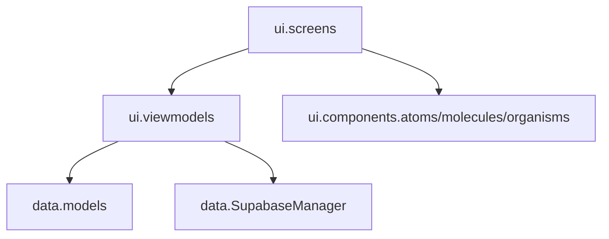
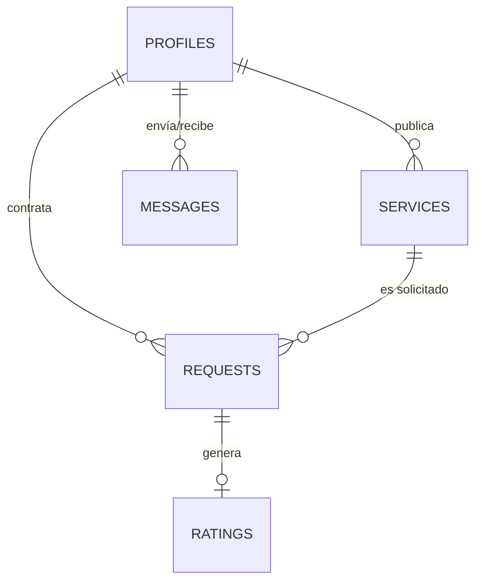

# 📖 Biblia Técnica de Ingeniería y Despliegue - YÁYA

Este documento constituye la fuente de verdad técnica para la plataforma **YÁYA**. Detalla la arquitectura, el modelado de datos, los estándares de codificación y los procedimientos de despliegue para garantizar la escalabilidad y mantenibilidad del sistema por parte de **BH++ Team**.

---

## 1. Arquitectura de Software: Clean MVVM + Atomic Design

YÁYA implementa una arquitectura robusta basada en la separación estricta de responsabilidades, permitiendo que la interfaz sea elástica y la lógica de negocio totalmente independiente.

### 1.1. Capas del Sistema (Package Structure)


*   **UI Layer (Stateless):** Funciones Composable puras que renderizan un `UiState`.
*   **ViewModel Layer:** Controladores de estado que gestionan corrutinas y transforman datos crudos en información lista para la vista (Principio DRY).
*   **Data Layer:** Integración directa con Supabase mediante el cliente global, gestionando Auth, Postgrest y Realtime.

### 1.3. Arquitectura de Clases (MVVM Pattern)
Para cada pantalla, se implementa el siguiente flujo de componentes:

*   **UiState (Data Class):** Inmutable, representa el estado total de la pantalla.
*   **ViewModel (ViewModel):** Única fuente de verdad. Se comunica con el `SupabaseManager` y actualiza el `UiState`.
*   **Screen (Composable):** Recibe el `UiState` y emite eventos de usuario al ViewModel.
*   **Components (Composables):** Átomos y moléculas desacoplados que renderizan partes específicas del `UiState`.

### 1.4. Engine de Validaciones de Entrada (ValidationUtils - DRY)
El componente `ValidationUtils` centraliza las reglas de negocio para la captura y edición de datos de usuario en toda la aplicación:
*   **Nombres:** Letras latinas (incluyendo tildes y ñ), espacios y guiones. Sin dígitos numéricos.
*   **Documento DNI/CC:** Formato exclusivamente numérico entre 6 y 12 dígitos.
*   **Teléfono móvil:** Cadena de exactamente 10 dígitos numéricos.
*   **Correo Electrónico:** Formato estándar RFC/Patterns (`Patterns.EMAIL_ADDRESS`).
*   **Contraseña Segura:** Mínimo 8 caracteres combinando mayúscula, minúscula y número o carácter especial.
*   **Fecha de Nacimiento:** Bloqueo en la UI de días futuros en el calendario (`SelectableDates`) y validación de fecha cronológica no futura (`isValidBirthDate`).
*   **Agendamiento de Citas:** Dirección de atención válida (mín. 5 caracteres), restricción UI de calendario a días presentes o futuros (`SelectableDates`), verificación de fecha no pasada (`isValidFutureDate`) y validación de hora no transcurrida para el día actual (`isValidScheduleTime`).

### 1.5. Arquitectura de Filtrado Geográfico por Municipio/Zona
YÁYA implementa una estrategia de filtrado multizona para segmentar la oferta de servicios según la ubicación geográfica del usuario y la cobertura del prestador:
*   **Modelos de Datos:** La propiedad opcional `municipality: String?` ("La Plata" por defecto) se integra en los modelos de dominio `UserProfile` y `Service`.
*   **Controles UI:** El componente `HomeTopBar` expone un chip interactivo de selección de municipio y `HomeScreen` despliega un diálogo modal de filtrado por zona.
*   **Lógica en ViewModel:** `HomeViewModel.applyFilters()` filtra dinámicamente el catálogo reactivo permitiendo seleccionar municipios específicos (La Plata, Nátaga, Paicol, Tesalia, Garzón, Neiva, Pitalito, Gigante) o la opción global "Todos".
*   **Captura de Datos:** Los formularios de `RegisterUserScreen`, `EditProfileScreen` y `CreateServiceScreen` integran controles para seleccionar y actualizar el municipio de atención y cobertura.

---

## 2. Modelado de Datos y Seguridad (Supabase PostgreSQL)

### 2.1. Diagrama Entidad-Relación (ERD)
YÁYA utiliza un esquema relacional optimizado para la intermediación de servicios:



### 2.2. Seguridad a Nivel de Fila (RLS)
Todas las tablas en Supabase tienen políticas **RLS** activas:
*   **Lectura:** Pública para perfiles y servicios activos.
*   **Escritura:** Restringida al `auth.uid()` del propietario (proteger identidad y finanzas).
*   **Negociación:** Solo el cliente y el prestador vinculados a una `request_id` pueden actualizar su estado.

### 2.3. Resiliencia en Serialización (KotlinX Serialization)
Los modelos de datos (`ServiceRequest`, `UserProfile`, `Message`, `Rating`, etc.) implementan valores por defecto defensivos para todas sus propiedades. Esto garantiza que las respuestas JSON provenientes de consultas con proyecciones relacionales parciales (ej: `Columns.raw("id, services!inner(provider_id)")`) se deserialicen de manera segura sin lanzar excepciones `MissingFieldException`.

### 2.4. Migración de Esquema (DDL Supabase PostgreSQL)
Para soportar el filtrado geográfico por municipio, la base de datos de Supabase integra la adición de la columna `municipality` en las tablas `public.profiles` y `public.services`:

```sql
-- Migración para agregar la columna municipality a las tablas public.profiles y public.services
ALTER TABLE public.profiles 
ADD COLUMN IF NOT EXISTS municipality text DEFAULT 'La Plata';

ALTER TABLE public.services 
ADD COLUMN IF NOT EXISTS municipality text DEFAULT 'La Plata';
```

---

## 3. Stack Tecnológico y Dependencias Clave

*   **Lenguaje:** Kotlin 2.4.10 (K2 Compiler, JVM Target 17).
*   **Target SDK:** Android API 37 (minSdk 26, versionCode 7, versionName "1.0.2").
*   **UI:** Jetpack Compose (Material 3) con soporte para arquitectura atómica y componentes de desplazamiento optimizados.
*   **Backend:** Supabase (PostgreSQL + Realtime + Storage).
*   **Permisos y Cumplimiento Google Play:** Declaración de `com.google.android.gms.permission.AD_ID` para servicios de analítica e identificador de anuncios en Google Play.
*   **Security Hardening:** Mitigación proactiva de vulnerabilidades (CVEs) mediante restricciones de dependencia (Netty, Bouncy Castle, HttpClient, Guava, jose4j).
*   **Observabilidad:** Firebase Crashlytics & Analytics (Telemetría de errores y métricas). Se utiliza el wrapper `CrashReporter.kt` para centralizar los reportes.
*   **Notificaciones:** Firebase Cloud Messaging (FCM V1) via Edge Functions.
*   **Multimedia:** Coil 3.1.0 (Async Image Loading).
*   **Reactividad:** Kotlin Flows & Coroutines para flujos asíncronos no bloqueantes.

---

## 4. Guía de Entorno de Desarrollo Local

### 4.1. Configuración del Repositorio
1.  **Clonar:** `git clone https://github.com/Brandon094/Y-YA_Mobile.git`
2.  **Android Studio:** Abrir proyecto con versión Ladybug o superior.
3.  **Variables de Entorno:** Configurar `secrets.properties` en la raíz:
    ```properties
    SUPABASE_URL="https://tu-proyecto.supabase.co"
    SUPABASE_ANON_KEY="tu-anon-key"
    ```

### 4.2. Compilación
*   **Debug:** Ejecutar tarea `app:assembleDebug`.
*   **Release:** Configurar el archivo `.jks` y ejecutar `app:bundleRelease` (genera el archivo `.aab` para Google Play con `versionCode = 7` y símbolos de depuración nativos NDK en nivel `FULL`).

---

## 5. Motor de Notificaciones, Tiempo Real y Estabilidad Visual

### 5.1. Observabilidad y Telemetría (Firebase)
YÁYA utiliza un motor dual de captura de errores para garantizar un 99.9% de estabilidad:
1.  **Crashes Fatales:** Capturados automáticamente por la SDK de Firebase Crashlytics.
2.  **Excepciones No Fatales:** Gestionadas por `CrashReporter.kt`. Este componente permite enviar logs personalizados y trazas de error desde bloques `try-catch`, permitiendo depurar fallos en la lógica de Supabase o red sin que la App se cierre para el usuario.

### 5.2. Flujo de Notificación Push (Edge Functions)
YÁYA utiliza lógica Server-Side para automatizar alertas sin saturar el cliente:
1.  Un evento (INSERT/UPDATE) en la DB dispara un **Webhook**.
2.  La Edge Function `notify-yaya-updates` (TypeScript) procesa el evento.
3.  Se identifica al destinatario y se envía la alerta via **FCM API V1**.

### 5.3. Conectividad Resiliente
Implementación de `ConnectivityObserver` basado en Flows que monitorea el hardware de red y notifica mediante el `YayaOfflineBanner` atómico.

### 5.4. Estabilidad de Layouts en Jetpack Compose
Para evitar excepciones en runtime como `IllegalStateException` durante la fase de medición, los layouts scrolleables evitan anidar componentes de scroll ilimitado (`LazyColumn` dentro de `Column` con `verticalScroll` sin restricciones fijas). Los contenedores en `NegotiationHistoryBox.kt`, `ConfirmacionScreen.kt` y `MyServicesScreen.kt` están optimizados con restricciones explícitas de altura (`heightIn`/`fillMaxHeight`).

---

### 6. Pipeline de Despliegue y Calidad (CI/CD)

1.  **Advanced CodeQL Analysis:** GitHub Actions (`.github/workflows/codeql.yml`) ejecuta análisis estático de código enfocado en Java 17 y Kotlin (`java-kotlin`), evaluando reglas de seguridad extendida (`security-extended,security-and-quality`).
2.  **Secret Management:** Inyección automatizada de `google-services.json` durante el pipeline de integración continua utilizando secretos de GitHub y sintaxis heredoc.
3.  **App Bundle & Depuración Nativa:** Generación del binario `.aab` con firma de producción SHA-256, `versionCode = 7` y la directiva `ndk { debugSymbolLevel = 'FULL' }` en `app/build.gradle.kts` para análisis nativo completo en Play Console.

---
*Documento certificado por la Dirección Técnica de BH++ Team - 2026*
